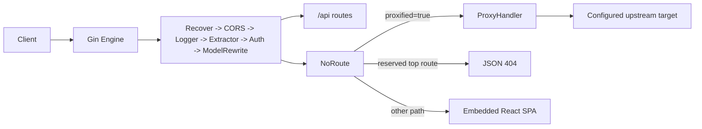
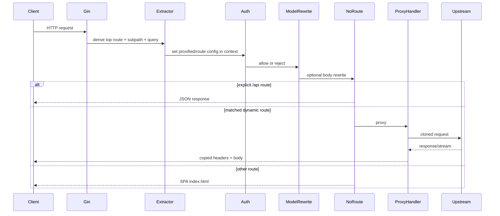
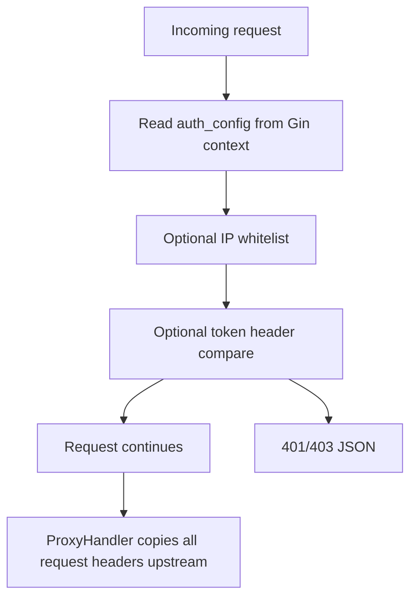
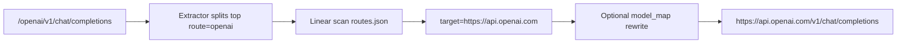
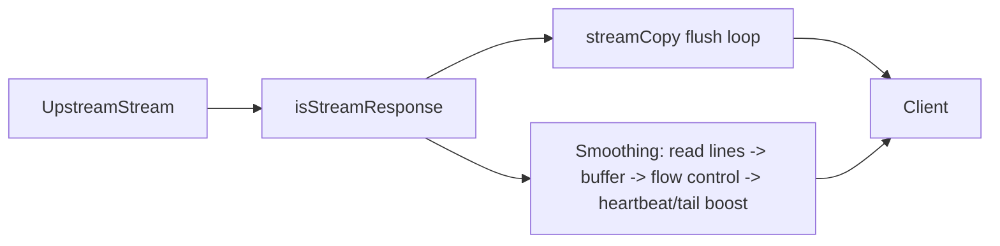

**Pre-Synthesis Inventories**

**Repository Map**

| Area | Role | Evidence |
|---|---|---|
| `main.go` | backend entrypoint; loads env, auth config, route watcher, Gin, frontend | [main.go#L13](C:/Users/Filipe/Downloads/proxify/proxify/main.go#L13) |
| `router/` | registers middleware and `/api` endpoints only | [router/router.go#L10](C:/Users/Filipe/Downloads/proxify/proxify/router/router.go#L10) |
| `controller/` | proxy handler, routes API, unused sample handlers | [controller/proxy.go#L17](C:/Users/Filipe/Downloads/proxify/proxify/controller/proxy.go#L17), [controller/routes.go#L10](C:/Users/Filipe/Downloads/proxify/proxify/controller/routes.go#L10), [controller/home.go#L10](C:/Users/Filipe/Downloads/proxify/proxify/controller/home.go#L10) |
| `middleware/` | CORS, auth, route extraction, model rewrite, panic recovery, request logging | [middleware/auth.go#L11](C:/Users/Filipe/Downloads/proxify/proxify/middleware/auth.go#L11), [middleware/extractor.go#L10](C:/Users/Filipe/Downloads/proxify/proxify/middleware/extractor.go#L10), [middleware/model_rewrite.go#L15](C:/Users/Filipe/Downloads/proxify/proxify/middleware/model_rewrite.go#L15) |
| `infra/config` | runtime config structs for auth and routes | [infra/config/auth.go#L9](C:/Users/Filipe/Downloads/proxify/proxify/infra/config/auth.go#L9), [infra/config/routes.go#L8](C:/Users/Filipe/Downloads/proxify/proxify/infra/config/routes.go#L8) |
| `infra/watcher` | hot-reloads `routes.json` via `fsnotify` + `atomic.Value` | [infra/watcher/routes.go#L14](C:/Users/Filipe/Downloads/proxify/proxify/infra/watcher/routes.go#L14) |
| `infra/stream` | stream copy helpers and optional “smoothing”/heartbeat/tail-boost logic | [infra/stream/smoothing.go#L20](C:/Users/Filipe/Downloads/proxify/proxify/infra/stream/smoothing.go#L20), [infra/stream/done.go#L5](C:/Users/Filipe/Downloads/proxify/proxify/infra/stream/done.go#L5) |
| `infra/logger` | zap+lumberjack logging | [infra/logger/main.go#L8](C:/Users/Filipe/Downloads/proxify/proxify/infra/logger/main.go#L8), [infra/logger/zap.go#L14](C:/Users/Filipe/Downloads/proxify/proxify/infra/logger/zap.go#L14) |
| `static.go` + `web/` | embedded React SPA used as marketing/docs UI, not admin control plane | [static.go#L20](C:/Users/Filipe/Downloads/proxify/proxify/static.go#L20), [web/src/router/index.tsx#L8](C:/Users/Filipe/Downloads/proxify/proxify/web/src/router/index.tsx#L8) |
| deployment/CI files | Docker, compose, shell deploy, GitHub Actions | [Dockerfile#L1](C:/Users/Filipe/Downloads/proxify/proxify/Dockerfile#L1), [docker-compose.yml#L1](C:/Users/Filipe/Downloads/proxify/proxify/docker-compose.yml#L1), [.github/workflows/ci-main.yml#L1](C:/Users/Filipe/Downloads/proxify/proxify/.github/workflows/ci-main.yml#L1) |

**Subsystem Inventory**

| Subsystem | Present? | Notes |
|---|---|---|
| Reverse proxy core | Yes | Transparent pass-through with header copy and byte streaming [controller/proxy.go#L17](C:/Users/Filipe/Downloads/proxify/proxify/controller/proxy.go#L17) |
| Provider adapter layer | Minimal only | Configured base URL + optional top-level `model` rewrite; no per-provider SDK/adapter packages [infra/config/routes.go#L8](C:/Users/Filipe/Downloads/proxify/proxify/infra/config/routes.go#L8), [util/model_override.go#L8](C:/Users/Filipe/Downloads/proxify/proxify/util/model_override.go#L8) |
| AuthN/AuthZ | Very limited | Global static token and IP whitelist only [middleware/auth.go#L11](C:/Users/Filipe/Downloads/proxify/proxify/middleware/auth.go#L11) |
| Multi-tenancy | Not found in code | No user/org/team data model; no tenant scoping in `go.mod` or code [go.mod#L1](C:/Users/Filipe/Downloads/proxify/proxify/go.mod#L1) |
| Rate limiting / quotas | Not found in code | No limiter libs or middleware in repo search; no Redis dependency [go.mod#L1](C:/Users/Filipe/Downloads/proxify/proxify/go.mod#L1) |
| Retry / failover / LB | Not found in code | Single target per route, no fallback logic [infra/config/routes.go#L8](C:/Users/Filipe/Downloads/proxify/proxify/infra/config/routes.go#L8) |
| Persistence / DB | Not found in code | Only config files and log files; no DB client dependency [go.mod#L1](C:/Users/Filipe/Downloads/proxify/proxify/go.mod#L1) |
| Frontend dashboard | No admin dashboard | Static site fetches `/api/routes`; no protected admin APIs [web/src/api/routes.ts#L9](C:/Users/Filipe/Downloads/proxify/proxify/web/src/api/routes.ts#L9) |
| Background workers | Only lightweight goroutines | route watcher and stream goroutines [infra/watcher/routes.go#L16](C:/Users/Filipe/Downloads/proxify/proxify/infra/watcher/routes.go#L16), [infra/stream/smoothing.go#L37](C:/Users/Filipe/Downloads/proxify/proxify/infra/stream/smoothing.go#L37) |

**Endpoint Inventory**

| Endpoint / Pattern | Method | Behavior | Evidence |
|---|---|---|---|
| `/api/` | `GET` | echoes current path | [router/router.go#L20](C:/Users/Filipe/Downloads/proxify/proxify/router/router.go#L20), [controller/home.go#L24](C:/Users/Filipe/Downloads/proxify/proxify/controller/home.go#L24) |
| `/api/routes` | `GET` | returns loaded route config, including `target` and `model_map` | [controller/routes.go#L10](C:/Users/Filipe/Downloads/proxify/proxify/controller/routes.go#L10) |
| `/assets/*`, `/x.svg`, `/favicon.svg`, `/vite.svg` | static | serves embedded frontend files | [static.go#L20](C:/Users/Filipe/Downloads/proxify/proxify/static.go#L20) |
| `/<configured-top-route>/*` | any | proxied in `NoRoute` if `Extractor` matched a route | [middleware/extractor.go#L28](C:/Users/Filipe/Downloads/proxify/proxify/middleware/extractor.go#L28), [static.go#L37](C:/Users/Filipe/Downloads/proxify/proxify/static.go#L37) |
| other non-`/api` unknown paths | any | SPA `index.html` fallback | [static.go#L52](C:/Users/Filipe/Downloads/proxify/proxify/static.go#L52) |
| health/admin/auth CRUD | not found in code | handlers exist but are unregistered | [controller/home.go#L10](C:/Users/Filipe/Downloads/proxify/proxify/controller/home.go#L10), [router/router.go#L10](C:/Users/Filipe/Downloads/proxify/proxify/router/router.go#L10) |

**Request Flow Trace**

1. `.env` is loaded, logger/auth/routes watcher initialized, and `auth_config` is injected into Gin context at startup [main.go#L15](C:/Users/Filipe/Downloads/proxify/proxify/main.go#L15).
2. Middleware order is `Recover -> CORS -> GinRequestLogger -> Extractor -> Auth -> ModelRewrite` [router/router.go#L12](C:/Users/Filipe/Downloads/proxify/proxify/router/router.go#L12).
3. `Extractor` splits the first path segment, appends query string into `sub`, and linearly scans loaded routes for a match [middleware/extractor.go#L12](C:/Users/Filipe/Downloads/proxify/proxify/middleware/extractor.go#L12).
4. `Auth` enforces optional IP whitelist and optional static token header for every request that survives `OPTIONS` CORS short-circuiting [middleware/cors.go#L18](C:/Users/Filipe/Downloads/proxify/proxify/middleware/cors.go#L18), [middleware/auth.go#L21](C:/Users/Filipe/Downloads/proxify/proxify/middleware/auth.go#L21).
5. `ModelRewrite` buffers the whole body and rewrites only the top-level `model` field if the route has `model_map` [middleware/model_rewrite.go#L30](C:/Users/Filipe/Downloads/proxify/proxify/middleware/model_rewrite.go#L30).
6. Explicit `/api/...` routes are handled normally; everything else goes through `NoRoute` [router/router.go#L20](C:/Users/Filipe/Downloads/proxify/proxify/router/router.go#L20), [static.go#L37](C:/Users/Filipe/Downloads/proxify/proxify/static.go#L37).
7. If `proxified=true`, `ProxyHandler` rebuilds the URL, clones request headers/body into a new upstream request, and uses a custom `http.Client` with no timeout [controller/proxy.go#L17](C:/Users/Filipe/Downloads/proxify/proxify/controller/proxy.go#L17).
8. Streaming responses are either raw-flushed or fed through smoothing/heartbeat/tail-boost goroutines [controller/proxy.go#L65](C:/Users/Filipe/Downloads/proxify/proxify/controller/proxy.go#L65), [infra/stream/smoothing.go#L20](C:/Users/Filipe/Downloads/proxify/proxify/infra/stream/smoothing.go#L20).

**Security Findings List**

- High: gateway auth header is forwarded upstream unchanged; using gateway token auth leaks the gateway secret to providers or internal upstreams [middleware/auth.go#L43](C:/Users/Filipe/Downloads/proxify/proxify/middleware/auth.go#L43), [controller/proxy.go#L33](C:/Users/Filipe/Downloads/proxify/proxify/controller/proxy.go#L33).
- High: request logger records `targetURL`, which includes query strings appended in `Extractor`; upstream API keys in query params can be written to logs [middleware/extractor.go#L14](C:/Users/Filipe/Downloads/proxify/proxify/middleware/extractor.go#L14), [middleware/gin.go#L30](C:/Users/Filipe/Downloads/proxify/proxify/middleware/gin.go#L30).
- High: reserved-route validation is buggy because config uses `"/api"` but reserved map stores `"api"`; a configured `/api` route can capture unmatched system paths [infra/config/reserved.go#L4](C:/Users/Filipe/Downloads/proxify/proxify/infra/config/reserved.go#L4), [infra/watcher/routes.go#L100](C:/Users/Filipe/Downloads/proxify/proxify/infra/watcher/routes.go#L100).
- Medium/High: CORS reflects arbitrary `Origin` and sets `Allow-Credentials: true` globally [middleware/cors.go#L11](C:/Users/Filipe/Downloads/proxify/proxify/middleware/cors.go#L11).
- Medium/High: no rate limits, quotas, per-route ACLs, tenant boundaries, or abuse controls are present in code [go.mod#L1](C:/Users/Filipe/Downloads/proxify/proxify/go.mod#L1).
- Medium: smoothing path is line-oriented and duplicates response header copy/status handling, which is fragile for non-SSE streams [controller/proxy.go#L57](C:/Users/Filipe/Downloads/proxify/proxify/controller/proxy.go#L57), [infra/stream/smoothing.go#L238](C:/Users/Filipe/Downloads/proxify/proxify/infra/stream/smoothing.go#L238).

# 1. Executive Summary

- Confirmed from code: Proxify is a very small, self-hosted HTTP reverse proxy for AI API endpoints, built with Gin, configured by `routes.json`, and optimized mainly around pass-through streaming behavior rather than policy or provider orchestration [main.go#L13](C:/Users/Filipe/Downloads/proxify/proxify/main.go#L13), [infra/config/routes.go#L8](C:/Users/Filipe/Downloads/proxify/proxify/infra/config/routes.go#L8), [controller/proxy.go#L17](C:/Users/Filipe/Downloads/proxify/proxify/controller/proxy.go#L17).
- Primary business purpose: give clients one base URL per provider prefix and optionally alias models without rewriting application code; it is closer to a thin reverse proxy than to an enterprise AI gateway [routes.json.example#L2](C:/Users/Filipe/Downloads/proxify/proxify/routes.json.example#L2), [middleware/model_rewrite.go#L15](C:/Users/Filipe/Downloads/proxify/proxify/middleware/model_rewrite.go#L15).
- Who it is for: small teams or hobby/self-hosted deployments that want a unified entrypoint and simple route control. Not confirmed as an enterprise platform because the code lacks tenancy, quotas, audit, provider health management, and control-plane primitives [go.mod#L1](C:/Users/Filipe/Downloads/proxify/proxify/go.mod#L1).
- Why the architecture matters: the repo demonstrates how far a tiny Go proxy can go with transparent streaming and hot-reloaded route config, but it also shows exactly where “AI gateway” claims stop and where platform requirements begin [infra/watcher/routes.go#L48](C:/Users/Filipe/Downloads/proxify/proxify/infra/watcher/routes.go#L48), [infra/stream/smoothing.go#L20](C:/Users/Filipe/Downloads/proxify/proxify/infra/stream/smoothing.go#L20).
- Top 5 takeaways:
- It is a lightweight proxy MVP, not a provider abstraction platform.
- Streaming is the most differentiated code path; auth/governance is the weakest.
- Route config hot reload is elegant but operationally brittle.
- Several small implementation choices create outsized security risk.
- A serious internal gateway should reuse only the simple pass-through core and redesign almost everything around policy, secrets, tenancy, and observability.

# 2. Product Intent and Core Capabilities

- Main problem solved: unify several provider base URLs behind a single self-hosted endpoint with transparent pass-through semantics and optional model aliasing [routes.json.example#L4](C:/Users/Filipe/Downloads/proxify/proxify/routes.json.example#L4), [util/model_override.go#L8](C:/Users/Filipe/Downloads/proxify/proxify/util/model_override.go#L8).
- Supported use cases: OpenAI-style SDK base URL swap, generic HTTP proxying to configured upstreams, SSE/chunked stream forwarding, and simple route discovery via `/api/routes` [controller/routes.go#L10](C:/Users/Filipe/Downloads/proxify/proxify/controller/routes.go#L10), [controller/proxy.go#L65](C:/Users/Filipe/Downloads/proxify/proxify/controller/proxy.go#L65).
- Core features confirmed from code:
- route-based upstream mapping with hot reload,
- optional static token auth and IP whitelist,
- optional top-level `model` rewrite,
- optional stream smoothing + heartbeat.  
  Evidence: [infra/watcher/routes.go#L48](C:/Users/Filipe/Downloads/proxify/proxify/infra/watcher/routes.go#L48), [middleware/auth.go#L11](C:/Users/Filipe/Downloads/proxify/proxify/middleware/auth.go#L11), [middleware/model_rewrite.go#L15](C:/Users/Filipe/Downloads/proxify/proxify/middleware/model_rewrite.go#L15), [infra/stream/smoothing.go#L20](C:/Users/Filipe/Downloads/proxify/proxify/infra/stream/smoothing.go#L20).
- Differentiators: the stream-smoothing path is the only genuinely custom subsystem; everything else is conventional reverse-proxy glue [infra/stream/smoothing.go#L63](C:/Users/Filipe/Downloads/proxify/proxify/infra/stream/smoothing.go#L63).
- Likely product assumptions inferred from code structure: single service instance, trusted operators editing local config files, same API key reused directly against upstreams, and low need for tenant/account governance.

# 3. Repository Overview

- Main modules:
- backend runtime: `main.go`, `router/`, `controller/`, `middleware/`, `infra/`, `util/`
- frontend marketing/docs SPA: `web/`
- deployment: `Dockerfile`, `docker-compose.yml`, `build.sh`, `deploy.sh`, `.github/workflows/*`
- Important files:
- route schema: [infra/config/routes.go#L8](C:/Users/Filipe/Downloads/proxify/proxify/infra/config/routes.go#L8)
- auth schema: [infra/config/auth.go#L9](C:/Users/Filipe/Downloads/proxify/proxify/infra/config/auth.go#L9)
- route hot reload: [infra/watcher/routes.go#L48](C:/Users/Filipe/Downloads/proxify/proxify/infra/watcher/routes.go#L48)
- proxy core: [controller/proxy.go#L17](C:/Users/Filipe/Downloads/proxify/proxify/controller/proxy.go#L17)
- frontend embedding: [static.go#L17](C:/Users/Filipe/Downloads/proxify/proxify/static.go#L17)
- Entrypoints and startup flow: `main()` loads `.env`, initializes logger, validates auth settings, loads/watches `routes.json`, creates Gin engine, injects auth config into context, registers middleware/routes, mounts the embedded SPA, and runs on `PORT` defaulting to `7777` [main.go#L15](C:/Users/Filipe/Downloads/proxify/proxify/main.go#L15), [util/env.go#L5](C:/Users/Filipe/Downloads/proxify/proxify/util/env.go#L5).

# 4. Architecture Deep Dive

- Full architecture: single binary, no database, no queue, no Redis, no service mesh. Dynamic route data is in-memory in an `atomic.Value`; auth config is loaded once from env; the React app is embedded into the same binary [infra/watcher/routes.go#L14](C:/Users/Filipe/Downloads/proxify/proxify/infra/watcher/routes.go#L14), [main.go#L42](C:/Users/Filipe/Downloads/proxify/proxify/main.go#L42), [static.go#L17](C:/Users/Filipe/Downloads/proxify/proxify/static.go#L17).
- Request lifecycle: `NoRoute` is the real proxy dispatcher. There is no wildcard proxy route; unmatched routes are either proxied, treated as reserved-system 404s, or served SPA content [static.go#L37](C:/Users/Filipe/Downloads/proxify/proxify/static.go#L37).
- Proxy flow vs translation flow:
- proxy flow: clone method/body/headers to upstream and pass response back nearly verbatim [controller/proxy.go#L24](C:/Users/Filipe/Downloads/proxify/proxify/controller/proxy.go#L24)
- translation flow: only route selection and optional top-level `model` substitution [middleware/extractor.go#L28](C:/Users/Filipe/Downloads/proxify/proxify/middleware/extractor.go#L28), [util/model_override.go#L22](C:/Users/Filipe/Downloads/proxify/proxify/util/model_override.go#L22)
- Stateless vs stateful:
- stateless request path: proxying itself
- stateful runtime state: current `routes.json` snapshot and on-disk logs [infra/watcher/routes.go#L14](C:/Users/Filipe/Downloads/proxify/proxify/infra/watcher/routes.go#L14), [infra/logger/zap.go#L81](C:/Users/Filipe/Downloads/proxify/proxify/infra/logger/zap.go#L81)
- External dependencies confirmed from code: Gin, fsnotify, zap, lumberjack, godotenv; no data-store or policy-engine dependencies [go.mod#L5](C:/Users/Filipe/Downloads/proxify/proxify/go.mod#L5).

# 5. Configuration System

- Confirmed from code: config is split between env (`PORT`, auth, stream flags, logger mode) and `routes.json`; auth is loaded once at startup, routes are hot-reloaded [infra/config/auth.go#L17](C:/Users/Filipe/Downloads/proxify/proxify/infra/config/auth.go#L17), [infra/config/routes.go#L22](C:/Users/Filipe/Downloads/proxify/proxify/infra/config/routes.go#L22), [infra/watcher/routes.go#L48](C:/Users/Filipe/Downloads/proxify/proxify/infra/watcher/routes.go#L48).
- YAML/env handling: JSON only for routes, `.env` only for env vars. No YAML, no schema validation library, no layered config precedence beyond `godotenv.Load()` then `os.Getenv` [main.go#L15](C:/Users/Filipe/Downloads/proxify/proxify/main.go#L15).
- Secret management pattern: plaintext env vars and shell-sourced `.env` files. No secret manager integration, no encryption at rest, no redaction layer [infra/config/auth.go#L19](C:/Users/Filipe/Downloads/proxify/proxify/infra/config/auth.go#L19), [deploy.sh#L11](C:/Users/Filipe/Downloads/proxify/proxify/deploy.sh#L11).
- Runtime concerns:
- route reload watches the file itself, not the directory; editor rename semantics may break reloads,
- `watcher.Errors` is never drained,
- if `routes.json` is missing at boot, watching is skipped and later file creation will not reload until restart.  
  Evidence: [infra/watcher/routes.go#L16](C:/Users/Filipe/Downloads/proxify/proxify/infra/watcher/routes.go#L16), [infra/watcher/routes.go#L43](C:/Users/Filipe/Downloads/proxify/proxify/infra/watcher/routes.go#L43), [infra/watcher/routes.go#L53](C:/Users/Filipe/Downloads/proxify/proxify/infra/watcher/routes.go#L53).
- Improvements: validate full URL schemes, compile a route map, add config checksum/versioning, support SIGHUP/admin reload, move auth config to same dynamic control plane, and separate deploy-only secrets from runtime `.env` (`GITHUB_TOKEN` is in `.env.example` but not used by the server) [.env.example#L3](C:/Users/Filipe/Downloads/proxify/proxify/.env.example#L3).

# 6. Authentication, Authorization, and Multi-Tenancy

- Confirmed from code: there are no users, orgs, tenants, teams, API-key records, or RBAC entities. Authorization is “global allow/deny” only [go.mod#L1](C:/Users/Filipe/Downloads/proxify/proxify/go.mod#L1), [middleware/auth.go#L11](C:/Users/Filipe/Downloads/proxify/proxify/middleware/auth.go#L11).
- API key handling: Proxify does not mint, store, hash, scope, or revoke upstream API keys. Client-supplied provider keys are simply forwarded upstream as headers/query params; the gateway’s own token, if used, is also forwarded unless upstream strips it [controller/proxy.go#L33](C:/Users/Filipe/Downloads/proxify/proxify/controller/proxy.go#L33).
- RBAC/permissions: not found in code.
- Tenant isolation: not found in code.
- Admin capabilities: not found in code; the frontend is public-facing content and a route list, not control-plane UI [web/src/router/index.tsx#L8](C:/Users/Filipe/Downloads/proxify/proxify/web/src/router/index.tsx#L8), [web/src/pages/home/comps/SupportedAPISection.tsx#L52](C:/Users/Filipe/Downloads/proxify/proxify/web/src/pages/home/comps/SupportedAPISection.tsx#L52).
- Security gaps:
- auth token can leak upstream,
- auth applies to everything including static SPA and `/api/routes`, so enabling auth effectively hides the docs site too,
- `OPTIONS` requests bypass auth because CORS returns early.  
  Evidence: [middleware/auth.go#L43](C:/Users/Filipe/Downloads/proxify/proxify/middleware/auth.go#L43), [middleware/cors.go#L18](C:/Users/Filipe/Downloads/proxify/proxify/middleware/cors.go#L18).

# 7. Provider Abstraction Layer

- Supported providers confirmed from example config only: OpenAI, Azure, DeepSeek, Claude, Gemini, Grok, Volcengine, Aliyun, SiliconFlow, Chutes, Moonshot, Cerebras, Groq, Fireworks, Novita, Together, Nebius, Poixe [routes.json.example#L2](C:/Users/Filipe/Downloads/proxify/proxify/routes.json.example#L2).
- Important distinction: this is not a provider adapter layer in the usual sense. There are no provider-specific request/response normalizers, auth injectors, capability registries, or fallback policies. Support means “there is a sample base URL in `routes.json.example`” [routes.json.example#L2](C:/Users/Filipe/Downloads/proxify/proxify/routes.json.example#L2), [controller/proxy.go#L17](C:/Users/Filipe/Downloads/proxify/proxify/controller/proxy.go#L17).
- Request normalization/translation confirmed from code:
- path prefix removal,
- optional top-level `model` rewrite,
- otherwise byte-transparent pass-through.  
  Evidence: [middleware/extractor.go#L12](C:/Users/Filipe/Downloads/proxify/proxify/middleware/extractor.go#L12), [middleware/model_rewrite.go#L38](C:/Users/Filipe/Downloads/proxify/proxify/middleware/model_rewrite.go#L38).
- Streaming handling: generic detection by response headers plus optional smoothing based on line-delimited reads and done-keyword heuristics for OpenAI/Anthropic-style events [controller/proxy.go#L111](C:/Users/Filipe/Downloads/proxify/proxify/controller/proxy.go#L111), [infra/stream/done.go#L5](C:/Users/Filipe/Downloads/proxify/proxify/infra/stream/done.go#L5).
- Retry/failover: not found in code.
- Extensibility: adding a new provider is easy if pass-through semantics are enough; it is hard if you need provider-specific auth injection, schema mapping, model discovery, tool-call normalization, or usage accounting because there is no plugin/adapter interface to extend.

# 8. Routing, Load Balancing, and Rate Limiting

- Routing logic confirmed from code: first path segment selects one `Route`, found by linear scan over `cfg.Routes`; the matched route provides a single `Target` base URL [middleware/extractor.go#L29](C:/Users/Filipe/Downloads/proxify/proxify/middleware/extractor.go#L29).
- Provider/model selection: provider = prefix; model = whatever client sent unless `model_map` rewrites the body [middleware/model_rewrite.go#L39](C:/Users/Filipe/Downloads/proxify/proxify/middleware/model_rewrite.go#L39).
- Fallback logic: not found in code.
- Load balancing strategy: not found in code; each route has exactly one `target` [infra/config/routes.go#L8](C:/Users/Filipe/Downloads/proxify/proxify/infra/config/routes.go#L8).
- Rate limiting: not found in code.
- Redis role: not found in code or dependencies [go.mod#L5](C:/Users/Filipe/Downloads/proxify/proxify/go.mod#L5).
- Scale risks:
- O(n) route lookup on every request,
- no global or per-route concurrency controls,
- no circuit breaking,
- no provider health model,
- no distributed coordination if horizontally scaled.  
  Evidence: [middleware/extractor.go#L31](C:/Users/Filipe/Downloads/proxify/proxify/middleware/extractor.go#L31), [controller/proxy.go#L39](C:/Users/Filipe/Downloads/proxify/proxify/controller/proxy.go#L39).

# 9. Privacy and Security Analysis

- Privacy claim in code terms: prompts/responses are not persisted to a DB because there is no DB. The server mostly streams bytes through and logs metadata, not bodies [controller/proxy.go#L74](C:/Users/Filipe/Downloads/proxify/proxify/controller/proxy.go#L74), [infra/logger/zap.go#L81](C:/Users/Filipe/Downloads/proxify/proxify/infra/logger/zap.go#L81).
- What is stored:
- log files under `log/`,
- route config in memory,
- auth config in memory,
- no prompt/response archival found in code.  
  Evidence: [infra/logger/main.go#L9](C:/Users/Filipe/Downloads/proxify/proxify/infra/logger/main.go#L9), [infra/watcher/routes.go#L76](C:/Users/Filipe/Downloads/proxify/proxify/infra/watcher/routes.go#L76).
- Metadata leakage risks:
- `targetURL` with query string logged,
- client IP logged,
- route list and upstream targets exposed via `/api/routes` if auth is disabled.  
  Evidence: [middleware/gin.go#L47](C:/Users/Filipe/Downloads/proxify/proxify/middleware/gin.go#L47), [controller/routes.go#L11](C:/Users/Filipe/Downloads/proxify/proxify/controller/routes.go#L11).
- Secret handling:
- plaintext env,
- no rotation flow,
- no hashing,
- no redaction,
- gateway auth header leak to upstream.  
  Evidence: [infra/config/auth.go#L17](C:/Users/Filipe/Downloads/proxify/proxify/infra/config/auth.go#L17), [controller/proxy.go#L33](C:/Users/Filipe/Downloads/proxify/proxify/controller/proxy.go#L33).
- Encryption strategy: TLS termination is not implemented in-app; likely expected at upstream ingress/reverse proxy. Not found in code.
- Auditability: weak. Logs have request ID, status, method, path, target URL, latency, client IP, but no actor identity, tenant, policy decision, upstream usage summary, or tamper-evident audit trail [middleware/gin.go#L17](C:/Users/Filipe/Downloads/proxify/proxify/middleware/gin.go#L17).
- Threat model assumptions likely inferred: trusted operators, low adversarial traffic, no hostile tenants, no need for compliance evidence.
- Security strengths:
- small codebase,
- no DB of prompts/responses,
- auth token minimum length check,
- panic recovery with request IDs.  
  Evidence: [main.go#L27](C:/Users/Filipe/Downloads/proxify/proxify/main.go#L27), [infra/response/error.go#L18](C:/Users/Filipe/Downloads/proxify/proxify/infra/response/error.go#L18).
- Security weaknesses:
- header leak upstream,
- log leak of query secrets,
- permissive CORS,
- reserved-route bug,
- root container,
- no rate limiting or abuse controls.  
  Evidence: [Dockerfile#L67](C:/Users/Filipe/Downloads/proxify/proxify/Dockerfile#L67), [middleware/cors.go#L13](C:/Users/Filipe/Downloads/proxify/proxify/middleware/cors.go#L13), [infra/watcher/routes.go#L100](C:/Users/Filipe/Downloads/proxify/proxify/infra/watcher/routes.go#L100).
- Concrete remediations: strip internal auth headers before proxying; sanitize logged URLs; validate reserved paths correctly; adopt allowlisted CORS; add limits/timeouts/quotas; move secrets to vault/KMS; separate control-plane auth from upstream credentials.

# 10. Observability and Operations

- Logging behavior: colored console + JSON file output via zap/lumberjack, daily file naming, fixed timezone defaulted to `Asia/Shanghai` [infra/logger/main.go#L18](C:/Users/Filipe/Downloads/proxify/proxify/infra/logger/main.go#L18), [infra/logger/zap.go#L108](C:/Users/Filipe/Downloads/proxify/proxify/infra/logger/zap.go#L108).
- Metrics: not found in code.
- Tracing: not found in code.
- Health checks: not found as live routes; a handler exists but is not registered [controller/home.go#L17](C:/Users/Filipe/Downloads/proxify/proxify/controller/home.go#L17), [router/router.go#L20](C:/Users/Filipe/Downloads/proxify/proxify/router/router.go#L20).
- Error reporting: local errors are wrapped into a consistent JSON envelope with `request_id`; upstream errors are passed through raw [infra/response/error.go#L13](C:/Users/Filipe/Downloads/proxify/proxify/infra/response/error.go#L13), [controller/proxy.go#L57](C:/Users/Filipe/Downloads/proxify/proxify/controller/proxy.go#L57).
- Missing operational controls:
- no metrics or dashboards,
- no admin endpoint for current config/version/health,
- no graceful shutdown,
- no readiness/liveness probes,
- no upstream health cache,
- no feature flags beyond env booleans.  
  Evidence: [main.go#L58](C:/Users/Filipe/Downloads/proxify/proxify/main.go#L58).

# 11. Data Model and Persistence

| Entity | Storage | Fields | Notes |
|---|---|---|---|
| `AuthConfig` | memory | `IPWhitelistRaw`, parsed `IPNets`, `TokenHeader`, `TokenKey` | startup-loaded only [infra/config/auth.go#L9](C:/Users/Filipe/Downloads/proxify/proxify/infra/config/auth.go#L9) |
| `RoutesConfig` | JSON file + memory | `Routes []Route` | hot-reloaded [infra/config/routes.go#L18](C:/Users/Filipe/Downloads/proxify/proxify/infra/config/routes.go#L18) |
| `Route` | JSON file + memory | `Path`, `Target`, `Name`, `Description`, `ModelMap` | one upstream per route [infra/config/routes.go#L8](C:/Users/Filipe/Downloads/proxify/proxify/infra/config/routes.go#L8) |
| log record | file | timestamp/level/caller/message fields | via zap JSON encoder [infra/logger/zap.go#L108](C:/Users/Filipe/Downloads/proxify/proxify/infra/logger/zap.go#L108) |

- DB/storage model: none beyond config files and logs.
- Relationships: one `RoutesConfig` contains many `Route` entries; no relational domain model.
- Cache strategy: only in-memory config snapshot and stream buffers [infra/watcher/routes.go#L14](C:/Users/Filipe/Downloads/proxify/proxify/infra/watcher/routes.go#L14), [infra/stream/smoothing.go#L35](C:/Users/Filipe/Downloads/proxify/proxify/infra/stream/smoothing.go#L35).
- Redis keys/patterns: not found in code.

# 12. API Surface

- Main endpoints:
- `GET /api/routes` returns `{ data: cfg.Routes }` [controller/routes.go#L10](C:/Users/Filipe/Downloads/proxify/proxify/controller/routes.go#L10)
- `GET /api/` returns current path [controller/home.go#L24](C:/Users/Filipe/Downloads/proxify/proxify/controller/home.go#L24)
- Proxy endpoints: every configured prefix becomes a proxy namespace, e.g. `/openai/v1/chat/completions` -> `https://api.openai.com/v1/chat/completions` [routes.json.example#L4](C:/Users/Filipe/Downloads/proxify/proxify/routes.json.example#L4), [util/url.go#L16](C:/Users/Filipe/Downloads/proxify/proxify/util/url.go#L16).
- Auth/admin endpoints: not found in code.
- Internal endpoints: none beyond `/api/routes` and SPA assets.
- Request/response contracts:
- request: whatever upstream expects; gateway does not normalize schema except optional `model` field rewrite,
- response: upstream response copied verbatim unless local errors occur.  
  Evidence: [controller/proxy.go#L33](C:/Users/Filipe/Downloads/proxify/proxify/controller/proxy.go#L33), [middleware/model_rewrite.go#L39](C:/Users/Filipe/Downloads/proxify/proxify/middleware/model_rewrite.go#L39).
- OpenAI-compatible behavior: partially. It works where provider path and payload shape are already OpenAI-compatible or close enough. There is no full OpenAI compatibility shim.
- Streaming compatibility: raw SSE/chunked forwarding is generic; smoothing adds OpenAI/Responses/Anthropic done-keyword assumptions [infra/stream/done.go#L5](C:/Users/Filipe/Downloads/proxify/proxify/infra/stream/done.go#L5).

# 13. Performance and Scalability

- Likely bottlenecks:
- linear route lookup,
- per-request `http.Client` creation,
- no shared transport tuning beyond `MaxIdleConnsPerHost`,
- model rewrite full-body buffering,
- line-based smoothing queues and timers.  
  Evidence: [middleware/extractor.go#L31](C:/Users/Filipe/Downloads/proxify/proxify/middleware/extractor.go#L31), [controller/proxy.go#L39](C:/Users/Filipe/Downloads/proxify/proxify/controller/proxy.go#L39), [middleware/model_rewrite.go#L31](C:/Users/Filipe/Downloads/proxify/proxify/middleware/model_rewrite.go#L31).
- Concurrency model: Gin request goroutines plus extra goroutines per smoothed stream. Fine for small loads; needs tighter bounds for large fan-out [infra/stream/smoothing.go#L37](C:/Users/Filipe/Downloads/proxify/proxify/infra/stream/smoothing.go#L37).
- Memory/CPU/network:
- raw proxy path is light,
- smoothing path intentionally trades latency profile for more CPU/timers/buffering,
- disabling compression helps streaming but hurts bulk transfer efficiency [controller/proxy.go#L43](C:/Users/Filipe/Downloads/proxify/proxify/controller/proxy.go#L43).
- Horizontal scaling readiness: stateless enough for simple scale-out because no DB/Redis, but no distributed quotas, sticky routing, config service, or shared observability means “scale-out” is operationally thin, not platform-grade.
- Streaming tradeoffs: smoothing may improve UX for token-by-token demos but it changes stream timing semantics and can mis-handle non-newline or binary streams [infra/stream/smoothing.go#L41](C:/Users/Filipe/Downloads/proxify/proxify/infra/stream/smoothing.go#L41).
- Redis impact: none, because Redis is absent.

# 14. Code Quality and Engineering Maturity

- Readability/modularity: backend is small and easy to read; responsibilities are separated into sensible packages [router/router.go#L10](C:/Users/Filipe/Downloads/proxify/proxify/router/router.go#L10).
- Maintainability concerns:
- several dead/unused paths,
- comments and docs drift,
- build/runtime coupling to frontend embed,
- some config/deploy inconsistencies.  
  Evidence: unused handlers in [controller/home.go#L10](C:/Users/Filipe/Downloads/proxify/proxify/controller/home.go#L10), unused constants in [infra/response/codes.go#L3](C:/Users/Filipe/Downloads/proxify/proxify/infra/response/codes.go#L3), [Dockerfile#L75](C:/Users/Filipe/Downloads/proxify/proxify/Dockerfile#L75) vs [docker-compose.yml#L11](C:/Users/Filipe/Downloads/proxify/proxify/docker-compose.yml#L11).
- Test coverage and quality: no Go tests or frontend tests found. `go test ./...` could not fully verify a clean checkout because `web/dist` is required by `//go:embed` and the repo does not ship it, plus the sandbox blocked default Go cache/module paths. That still confirms build coupling and absence of test coverage [static.go#L17](C:/Users/Filipe/Downloads/proxify/proxify/static.go#L17), [build.sh#L19](C:/Users/Filipe/Downloads/proxify/proxify/build.sh#L19).
- Patterns used well: atomic route snapshot; simple middleware chain; request IDs; log rotation [infra/watcher/routes.go#L14](C:/Users/Filipe/Downloads/proxify/proxify/infra/watcher/routes.go#L14), [middleware/gin.go#L17](C:/Users/Filipe/Downloads/proxify/proxify/middleware/gin.go#L17).
- Anti-patterns:
- permissive CORS reflection,
- copying all headers blindly,
- config validation bug on reserved routes,
- always-on debug logging inside smoothing,
- dead code left in production tree.  
  Evidence: [middleware/cors.go#L13](C:/Users/Filipe/Downloads/proxify/proxify/middleware/cors.go#L13), [controller/proxy.go#L33](C:/Users/Filipe/Downloads/proxify/proxify/controller/proxy.go#L33), [infra/stream/smoothing.go#L72](C:/Users/Filipe/Downloads/proxify/proxify/infra/stream/smoothing.go#L72).
- Production-readiness assessment: strong enough for hobby/small-team MVP; not enterprise-ready.

# 15. Deployment and Infrastructure

- Docker/system deployment patterns present: multi-stage Docker build, `docker-compose`, shell deploy scripts with PM2/system directory layout, GitHub Actions release/deploy workflows [Dockerfile#L4](C:/Users/Filipe/Downloads/proxify/proxify/Dockerfile#L4), [deploy.sh#L41](C:/Users/Filipe/Downloads/proxify/proxify/deploy.sh#L41), [.github/workflows/ci-main.yml#L16](C:/Users/Filipe/Downloads/proxify/proxify/.github/workflows/ci-main.yml#L16).
- Required infra dependencies: none for runtime besides filesystem and network. CI/CD relies on GitHub Releases, SSH, Docker Hub, PM2, `jq`, `curl`, `unzip`, `file` [deploy.sh#L98](C:/Users/Filipe/Downloads/proxify/proxify/deploy.sh#L98), [web/deploy.sh#L31](C:/Users/Filipe/Downloads/proxify/proxify/web/deploy.sh#L31).
- Local dev workflow: Vite dev server proxies `/api` to backend; backend needs built frontend for full binary build [web/vite.config.ts#L17](C:/Users/Filipe/Downloads/proxify/proxify/web/vite.config.ts#L17), [build.sh#L19](C:/Users/Filipe/Downloads/proxify/proxify/build.sh#L19).
- Production deployment concerns:
- Dockerfile exposes `8080` while app defaults to `7777`,
- runtime container runs as root because non-root lines are commented out,
- no healthcheck,
- CI mostly builds/releases on tags, not PR validation,
- image names drift between `poixeai` and `terobox`.  
  Evidence: [Dockerfile#L75](C:/Users/Filipe/Downloads/proxify/proxify/Dockerfile#L75), [Dockerfile#L67](C:/Users/Filipe/Downloads/proxify/proxify/Dockerfile#L67), [docker-compose.yml#L9](C:/Users/Filipe/Downloads/proxify/proxify/docker-compose.yml#L9), [.github/workflows/ci-docker.yml#L9](C:/Users/Filipe/Downloads/proxify/proxify/.github/workflows/ci-docker.yml#L9).

# 16. Gap Analysis for Our Product

| Capability | Status in Proxify | Priority |
|---|---|---|
| Policy engine | Absent | High |
| Prompt/content inspection | Absent | High |
| PII controls | Absent | High |
| Jailbreak detection | Absent | High |
| Abuse/risk scoring | Absent | High |
| Tenant billing/showback | Absent | High |
| Audit logs | Partially present: basic request logs only | High |
| Approval workflows | Absent | Medium |
| Admin dashboards | Absent; marketing SPA only | High |
| Model governance/catalog | Absent beyond static route list | High |
| Provider quotas | Absent | High |
| Compliance features | Absent | High |
| SSO/SAML/OIDC | Absent | High |
| Budget controls | Absent | High |
| Human review hooks | Absent | Medium |
| Incident response hooks/webhooks | Absent | Medium |

Evidence baseline: no corresponding packages, endpoints, or dependencies in [go.mod#L1](C:/Users/Filipe/Downloads/proxify/proxify/go.mod#L1), backend route tree in [router/router.go#L10](C:/Users/Filipe/Downloads/proxify/proxify/router/router.go#L10), and frontend route tree in [web/src/router/index.tsx#L8](C:/Users/Filipe/Downloads/proxify/proxify/web/src/router/index.tsx#L8).

# 17. Recommendations for the Tech Lead

- Immediate improvements:
- strip internal auth headers before upstream proxying,
- sanitize logged URLs and never log raw query strings,
- fix reserved-route validation to normalize leading slash,
- harden CORS,
- add explicit upstream timeouts and request-size limits,
- remove or gate smoothing for non-SSE content types.  
  Evidence anchors: [middleware/auth.go#L43](C:/Users/Filipe/Downloads/proxify/proxify/middleware/auth.go#L43), [middleware/gin.go#L47](C:/Users/Filipe/Downloads/proxify/proxify/middleware/gin.go#L47), [infra/watcher/routes.go#L100](C:/Users/Filipe/Downloads/proxify/proxify/infra/watcher/routes.go#L100), [controller/proxy.go#L39](C:/Users/Filipe/Downloads/proxify/proxify/controller/proxy.go#L39).
- Medium-term refactors:
- replace linear route scans with precompiled route map,
- build a shared reusable transport/client pool,
- split gateway runtime from embedded marketing frontend,
- add health/readiness/config version endpoints,
- add structured upstream error classification and metrics,
- refactor model rewrite into endpoint-aware adapter hooks.  
  Evidence: [middleware/extractor.go#L31](C:/Users/Filipe/Downloads/proxify/proxify/middleware/extractor.go#L31), [static.go#L17](C:/Users/Filipe/Downloads/proxify/proxify/static.go#L17).
- Long-term redesign ideas:
- introduce control plane + policy engine + tenant identity,
- add provider registry with capabilities, quotas, health, and retry/fallback policy,
- store audit events and usage records,
- separate operator auth from end-user auth,
- integrate secrets manager and OIDC/SSO,
- add streaming-aware observability and guardrails.  
  Rationale: these are absent in code and required for a serious internal AI gateway.
- What to reuse:
- small Go footprint,
- route hot-reload idea,
- simple request-ID logging,
- raw streaming proxy path as a baseline.  
- What to avoid copying:
- blind header forwarding,
- permissive CORS,
- route validation bug,
- build coupling to frontend artifacts,
- no-test release workflows.
- What to redesign from scratch:
- auth/identity model,
- policy/quota/governance layer,
- provider abstraction,
- observability plane,
- admin/control plane.

# 18. Final Verdict

- MVP strength: yes. For a lightweight self-hosted proxy that forwards AI API traffic with minimal client changes, the architecture is strong enough and easy to understand [controller/proxy.go#L17](C:/Users/Filipe/Downloads/proxify/proxify/controller/proxy.go#L17).
- Enterprise production strength: no. It lacks the core control-plane, safety, audit, multi-tenant, and resilience features expected of an enterprise AI gateway.
- Teams that could adopt it as-is: individual developers, small startups, internal prototypes, or labs that need a transparent model proxy and accept operational/manual controls.
- What must change before serious internal-platform use: secret hygiene, auth separation, tenant model, policy engine, quotas, observability, admin APIs, rate limiting, upstream resilience, and compliance/audit primitives.

## Actionable Change List for Our Product

1. Treat Proxify as a thin data-plane reference, not as a control-plane template.
2. Reuse only the transparent pass-through proxy and basic route hot-reload concept.
3. Build a real provider abstraction with capability metadata, auth injectors, retries, failover, and per-provider health.
4. Introduce a tenant-aware identity model with scoped API keys, OIDC/SSO, quotas, and audit events.
5. Put policy, prompt inspection, PII controls, and budget enforcement in front of the proxy path.
6. Replace ad hoc logging with redacted structured events, metrics, traces, and streaming diagnostics.
7. Enforce outbound header allowlists and never forward internal auth material.
8. Separate operator/admin surfaces from public proxy and docs surfaces.
9. Add explicit timeout/limit/circuit-breaking behavior for every upstream hop.
10. Make deployment reproducible: non-root containers, health checks, PR CI, tests, and config validation.

# Leadership Summary

Proxify is a compact Go reverse proxy for AI APIs, not a full AI gateway platform. The codebase is small, readable, and practical: it hot-reloads a JSON route file, applies optional static token/IP auth, can rewrite the top-level `model` field, and forwards streaming responses with a custom smoothing path. That makes it a solid MVP reference for a lightweight self-hosted proxy.

The gap to an enterprise internal gateway is large. There is no tenant model, RBAC, OIDC, quotas, provider health, retries, audit ledger, policy engine, prompt inspection, abuse controls, or admin plane. Security and ops weaknesses are concrete, not theoretical: internal auth headers are forwarded upstream, query-string secrets can leak to logs, CORS is too permissive, reserved-route protection is buggy, and there are no rate limits or health endpoints. For our product, the right move is to reuse the thin pass-through data-plane ideas, but redesign identity, governance, observability, and provider orchestration from scratch.

# Prioritized Engineering Action List

- High:
- Strip internal auth headers before proxying.
- Stop logging raw target URLs/query strings.
- Fix reserved-route validation and path normalization.
- Add rate limits, quotas, request-size caps, and upstream timeouts.
- Introduce tenant-aware auth, audit logs, and provider governance.
- High:
- Build provider registry + health + retry/failover policy.
- Add metrics, traces, readiness/liveness, and config version endpoints.
- Move secrets to managed secret storage and add OIDC/SSO.
- Medium:
- Replace linear route scans with compiled maps and shared transports.
- Make stream smoothing opt-in per content type/provider.
- Separate embedded marketing UI from the gateway binary.
- Low:
- Clean dead code, unify deployment docs/image names, and add non-root container defaults.

Verification note: no tests were present, and `go test ./...` could not fully validate a clean checkout because the main package depends on generated `web/dist` assets via `//go:embed` and the sandbox blocked default Go cache/module paths.

