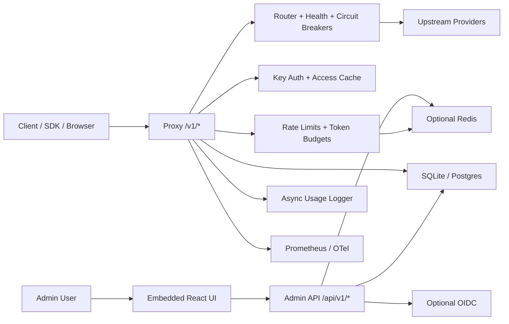
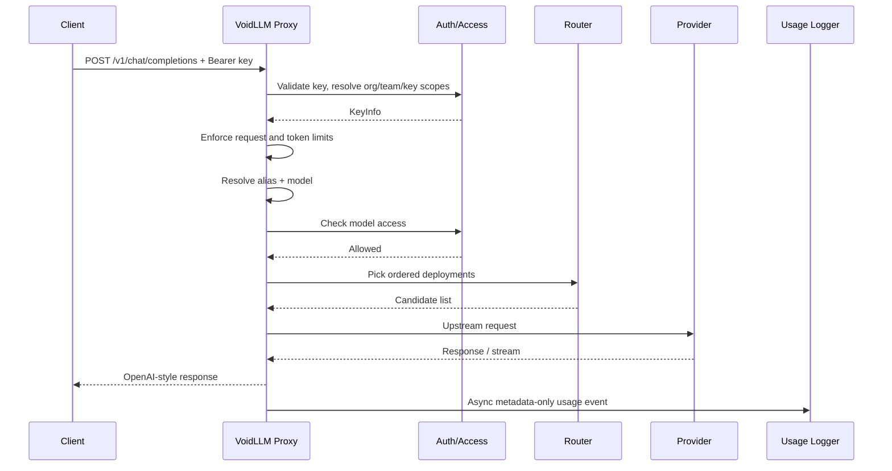
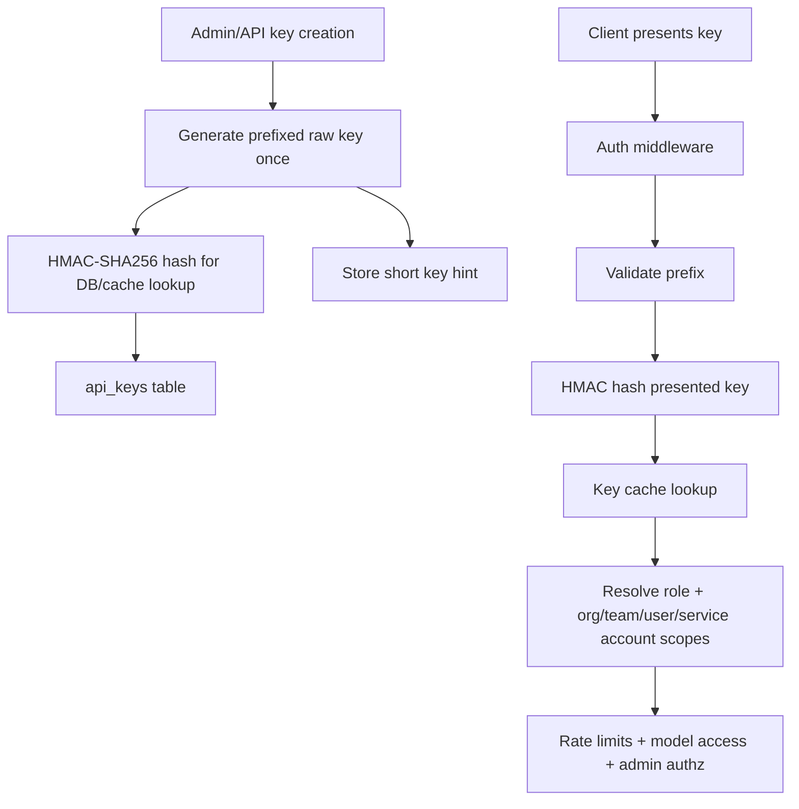
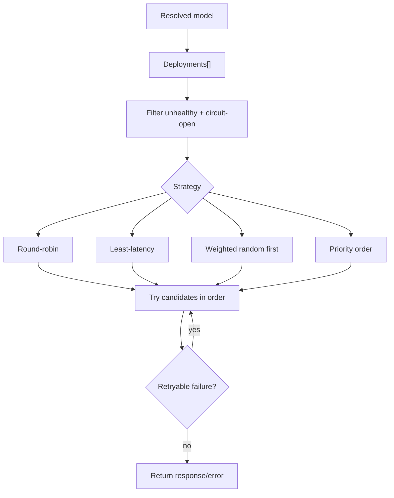

# Repository Map

| Path | What it does | Evidence |
|---|---|---|
| `cmd/voidllm` | Main binary entrypoint, subcommands, config load, app bootstrap | [main.go#L17](C:/Users/Filipe/Downloads/void-llm/voidllm/cmd/voidllm/main.go#L17) |
| `internal/app` | Composition root: DB, license, caches, Redis, health, routing, HTTP apps, shutdown | [app.go#L126](C:/Users/Filipe/Downloads/void-llm/voidllm/internal/app/app.go#L126), [routes.go](C:/Users/Filipe/Downloads/void-llm/voidllm/internal/app/routes.go) |
| `internal/api/admin` | Control-plane REST API for users, orgs, teams, keys, models, deployments, SSO, MCP, license | [routes.go](C:/Users/Filipe/Downloads/void-llm/voidllm/internal/api/admin/routes.go) |
| `internal/proxy` | Data-plane OpenAI-compatible proxy handler, adapters, model registry, headers, streaming | [handler.go#L146](C:/Users/Filipe/Downloads/void-llm/voidllm/internal/proxy/handler.go#L146), [adapter.go](C:/Users/Filipe/Downloads/void-llm/voidllm/internal/proxy/adapter.go) |
| `internal/router` | Deployment candidate selection and ordering | [router.go#L48](C:/Users/Filipe/Downloads/void-llm/voidllm/internal/router/router.go#L48) |
| `internal/auth` | API key auth, RBAC, bootstrap admin/user creation, key cache loading | [auth.go#L74](C:/Users/Filipe/Downloads/void-llm/voidllm/internal/auth/auth.go#L74), [bootstrap.go#L40](C:/Users/Filipe/Downloads/void-llm/voidllm/internal/auth/bootstrap.go#L40) |
| `internal/db` | Relational persistence, migrations, CRUD/query layers | [db.go](C:/Users/Filipe/Downloads/void-llm/voidllm/internal/db/db.go), [migrate.go](C:/Users/Filipe/Downloads/void-llm/voidllm/internal/db/migrate.go), [0001_initial_schema.up.sql](C:/Users/Filipe/Downloads/void-llm/voidllm/internal/db/migrations/0001_initial_schema.up.sql) |
| `internal/ratelimit` | In-memory rate limiter and token budget checker | [rate_limiter.go#L44](C:/Users/Filipe/Downloads/void-llm/voidllm/internal/ratelimit/rate_limiter.go#L44), [token_counter.go#L74](C:/Users/Filipe/Downloads/void-llm/voidllm/internal/ratelimit/token_counter.go#L74) |
| `internal/redis` | Distributed counters and cache invalidation pub/sub | [rate_limiter.go](C:/Users/Filipe/Downloads/void-llm/voidllm/internal/redis/rate_limiter.go), [token_counter.go](C:/Users/Filipe/Downloads/void-llm/voidllm/internal/redis/token_counter.go), [pubsub.go](C:/Users/Filipe/Downloads/void-llm/voidllm/internal/redis/pubsub.go) |
| `internal/health`, `internal/circuitbreaker` | Deployment health probing and fail-fast protection | [checker.go#L142](C:/Users/Filipe/Downloads/void-llm/voidllm/internal/health/checker.go#L142) |
| `internal/usage`, `internal/audit` | Async usage metering and admin audit logging | [logger.go#L92](C:/Users/Filipe/Downloads/void-llm/voidllm/internal/usage/logger.go#L92), [middleware.go#L42](C:/Users/Filipe/Downloads/void-llm/voidllm/internal/audit/middleware.go#L42) |
| `internal/config` | YAML/env config load, interpolation, validation, redaction | [config.go#L467](C:/Users/Filipe/Downloads/void-llm/voidllm/internal/config/config.go#L467), [validate.go](C:/Users/Filipe/Downloads/void-llm/voidllm/internal/config/validate.go) |
| `internal/mcp` | MCP gateway, MCP HTTP transport, Code Mode runtime/tooling | [http_transport.go#L91](C:/Users/Filipe/Downloads/void-llm/voidllm/internal/mcp/http_transport.go#L91), [codemode_exec.go](C:/Users/Filipe/Downloads/void-llm/voidllm/internal/mcp/codemode_exec.go) |
| `internal/license`, `internal/otel`, `internal/metrics` | Enterprise feature gating, tracing, Prometheus metrics | [features.go](C:/Users/Filipe/Downloads/void-llm/voidllm/internal/license/features.go), [otel.go#L26](C:/Users/Filipe/Downloads/void-llm/voidllm/internal/otel/otel.go#L26), [metrics.go](C:/Users/Filipe/Downloads/void-llm/voidllm/internal/metrics/metrics.go) |
| `ui` | Embedded React admin/dashboard SPA | [App.tsx](C:/Users/Filipe/Downloads/void-llm/voidllm/ui/src/App.tsx), [client.ts](C:/Users/Filipe/Downloads/void-llm/voidllm/ui/src/api/client.ts) |
| `chart`, `Dockerfile`, `docker-compose*.yaml` | Deployment assets for container and Kubernetes | [Dockerfile](C:/Users/Filipe/Downloads/void-llm/voidllm/Dockerfile), [docker-compose.enterprise.yaml](C:/Users/Filipe/Downloads/void-llm/voidllm/docker-compose.enterprise.yaml), [values.yaml](C:/Users/Filipe/Downloads/void-llm/voidllm/chart/voidllm/values.yaml) |
| `.github/workflows` | CI, release, CodeQL, scorecard | [ci.yml](C:/Users/Filipe/Downloads/void-llm/voidllm/.github/workflows/ci.yml), [release.yml](C:/Users/Filipe/Downloads/void-llm/voidllm/.github/workflows/release.yml) |

# Subsystem Inventory

| Subsystem | Purpose | Status |
|---|---|---|
| Control plane | Admin REST API + SPA for identity, access, models, deployments, usage, SSO, MCP | Confirmed from code |
| Data plane | OpenAI-style `/v1/*` proxy with auth, limits, routing, usage logging | Confirmed from code |
| Identity & RBAC | Users, orgs, teams, memberships, service accounts, API/session/invite keys | Confirmed from code |
| Config & bootstrap | YAML/env config, DB migrations, bootstrap admin path, model sync | Confirmed from code |
| Routing & resilience | Strategy-based deployment ordering, health checks, circuit breakers | Confirmed from code |
| Metering | Token counts, request counts, cost estimation, hourly rollups | Confirmed from code |
| Distributed coordination | Redis-backed counters and pub/sub invalidation | Confirmed from code |
| Enterprise add-ons | OIDC SSO, OTel, audit logs, cost reports, multi-org limits | Confirmed from code |
| MCP gateway / Code Mode | Tool brokering and sandboxed execution using gateway auth/access | Confirmed from code |
| Deployment layer | Docker, Compose, Helm, GitHub Actions | Confirmed from code |

# Request Flow Trace

1. Client sends `Bearer` key to `/v1/*`; auth middleware validates key prefix, HMAC-hashes the presented key, and resolves cached key metadata. [auth.go#L74](C:/Users/Filipe/Downloads/void-llm/voidllm/internal/auth/auth.go#L74)
2. Proxy handler rejects drain mode, parses JSON body, requires `model`, and attaches request ID/tracing. [handler.go#L146](C:/Users/Filipe/Downloads/void-llm/voidllm/internal/proxy/handler.go#L146)
3. It enforces request-window limits and token budgets across key, team, and org scopes. [handler.go#L462](C:/Users/Filipe/Downloads/void-llm/voidllm/internal/proxy/handler.go#L462), [rate_limiter.go#L44](C:/Users/Filipe/Downloads/void-llm/voidllm/internal/ratelimit/rate_limiter.go#L44), [token_counter.go#L74](C:/Users/Filipe/Downloads/void-llm/voidllm/internal/ratelimit/token_counter.go#L74)
4. It resolves model aliases and effective model registry entries from YAML + DB overlay. [registry.go#L95](C:/Users/Filipe/Downloads/void-llm/voidllm/internal/proxy/registry.go#L95), [registry.go#L186](C:/Users/Filipe/Downloads/void-llm/voidllm/internal/proxy/registry.go#L186)
5. It checks model access allowlists for org/team/key. [model_access.go](C:/Users/Filipe/Downloads/void-llm/voidllm/internal/db/model_access.go)
6. It asks the router for ordered deployment candidates based on health, circuit breaker state, and strategy. [router.go#L48](C:/Users/Filipe/Downloads/void-llm/voidllm/internal/router/router.go#L48)
7. It builds upstream requests, normalizes the body, injects provider auth, and applies adapter transforms for Anthropic/Azure when needed. [handler.go#L557](C:/Users/Filipe/Downloads/void-llm/voidllm/internal/proxy/handler.go#L557), [anthropic.go](C:/Users/Filipe/Downloads/void-llm/voidllm/internal/proxy/anthropic.go), [azure.go](C:/Users/Filipe/Downloads/void-llm/voidllm/internal/proxy/azure.go)
8. It retries across alternate deployments on transport errors and retryable 5xx responses until `max_retries` is exhausted. [router.go#L84](C:/Users/Filipe/Downloads/void-llm/voidllm/internal/router/router.go#L84), [handler.go](C:/Users/Filipe/Downloads/void-llm/voidllm/internal/proxy/handler.go)
9. It streams SSE back to the client or buffers a normal response, extracting usage where possible. [handler.go#L677](C:/Users/Filipe/Downloads/void-llm/voidllm/internal/proxy/handler.go#L677)
10. It asynchronously records metadata-only usage and updates counters/rollups. [logger.go#L92](C:/Users/Filipe/Downloads/void-llm/voidllm/internal/usage/logger.go#L92), [usage_aggregation.go](C:/Users/Filipe/Downloads/void-llm/voidllm/internal/db/usage_aggregation.go)

# Security Findings List

| Severity | Finding | What it means | Evidence |
|---|---|---|---|
| High | Access semantics mismatch | Empty allowlists behave as pass-through in code; comments/docs imply stricter semantics in some MCP paths | [model_access.go](C:/Users/Filipe/Downloads/void-llm/voidllm/internal/db/model_access.go), [mcp_access.go](C:/Users/Filipe/Downloads/void-llm/voidllm/internal/db/mcp_access.go) |
| High | Multi-node key propagation gap | Key rotation invalidates old key across Redis, but newly created key may not be immediately warm on other nodes | [keys.go](C:/Users/Filipe/Downloads/void-llm/voidllm/internal/api/admin/keys.go), [pubsub.go](C:/Users/Filipe/Downloads/void-llm/voidllm/internal/redis/pubsub.go) |
| High | Admin TLS config appears unwired | Config validates TLS cert/key, but runtime startup uses `Listen(...)` only | [config.go](C:/Users/Filipe/Downloads/void-llm/voidllm/internal/config/config.go), [validate.go](C:/Users/Filipe/Downloads/void-llm/voidllm/internal/config/validate.go), [routes.go](C:/Users/Filipe/Downloads/void-llm/voidllm/internal/app/routes.go) |
| Medium | Redis fail-open rate limiting | Redis outages allow traffic instead of denying it | [internal/redis/rate_limiter.go](C:/Users/Filipe/Downloads/void-llm/voidllm/internal/redis/rate_limiter.go), [redis_checker.go#L41](C:/Users/Filipe/Downloads/void-llm/voidllm/internal/ratelimit/redis_checker.go#L41) |
| Medium | SPA token storage is weaker than cookie sessions | OIDC/login ends in browser-managed bearer token storage; UI uses `localStorage` | [oidc.go](C:/Users/Filipe/Downloads/void-llm/voidllm/internal/api/admin/oidc.go), [client.ts](C:/Users/Filipe/Downloads/void-llm/voidllm/ui/src/api/client.ts) |
| Medium | Team-admin authz path likely user-centric | `requireTeamAccess` appears to depend on `UserID`, which is fragile for non-user team keys | [authz.go](C:/Users/Filipe/Downloads/void-llm/voidllm/internal/api/admin/authz.go) |
| Medium | Public metrics/health by default | `/metrics`, `/healthz`, `/readyz` are mounted without auth | [routes.go](C:/Users/Filipe/Downloads/void-llm/voidllm/internal/app/routes.go) |
| Medium | Chart/runtime drift | Helm image repo mismatch and Redis auth wiring mismatch increase deployment risk | [release.yml](C:/Users/Filipe/Downloads/void-llm/voidllm/.github/workflows/release.yml), [values.yaml](C:/Users/Filipe/Downloads/void-llm/voidllm/chart/voidllm/values.yaml), [configmap.yaml](C:/Users/Filipe/Downloads/void-llm/voidllm/chart/voidllm/templates/configmap.yaml) |
| Low | License heartbeat phones home | Relevant for air-gapped/privacy-sensitive installs | [heartbeat.go#L83](C:/Users/Filipe/Downloads/void-llm/voidllm/internal/license/heartbeat.go#L83) |
| Low | No built-in prompt policy engine | Good for privacy, but no inline content safety or PII controls | Absence confirmed across [proxy](C:/Users/Filipe/Downloads/void-llm/voidllm/internal/proxy), [api/admin](C:/Users/Filipe/Downloads/void-llm/voidllm/internal/api/admin), [config](C:/Users/Filipe/Downloads/void-llm/voidllm/internal/config) |

# 1. Executive Summary

voidLLM is a single-binary Go application that combines an OpenAI-compatible LLM proxy with an admin control plane and embedded React dashboard. Confirmed from code, its core job is to hold upstream provider credentials centrally, authenticate local callers with first-party API keys, enforce access and quota rules, route to one or more deployments, and record metadata-only usage/cost telemetry without persisting prompt or response bodies. Evidence: [main.go#L17](C:/Users/Filipe/Downloads/void-llm/voidllm/cmd/voidllm/main.go#L17), [app.go#L126](C:/Users/Filipe/Downloads/void-llm/voidllm/internal/app/app.go#L126), [handler.go#L146](C:/Users/Filipe/Downloads/void-llm/voidllm/internal/proxy/handler.go#L146).

Primary business purpose, likely inferred from code structure, is to give an internal platform team a self-hosted AI gateway that makes provider sprawl manageable: one endpoint, one governance surface, per-tenant controls, provider routing, and usage visibility. The architecture matters because it is intentionally simple to deploy, but that simplicity comes from collapsing control plane and data plane into one process and relying on in-memory caches plus optional Redis, which creates clear tradeoffs in multi-node consistency and enterprise hardening. Evidence: [routes.go](C:/Users/Filipe/Downloads/void-llm/voidllm/internal/app/routes.go), [db.go](C:/Users/Filipe/Downloads/void-llm/voidllm/internal/db/db.go), [pubsub.go](C:/Users/Filipe/Downloads/void-llm/voidllm/internal/redis/pubsub.go).

Top 5 takeaways for a tech lead:
1. It is a strong MVP architecture for a self-hosted internal AI gateway: compact, readable, and operationally straightforward.
2. Its best ideas are the metadata-only usage model, layered key/team/org controls, and provider/deployment abstraction.
3. Its biggest weaknesses are enterprise-consistency gaps: cache invalidation edge cases, fail-open Redis rate limiting, and policy semantics drift.
4. “Privacy-first” is mostly true in storage behavior, but it does not mean content governance, DLP, or compliance control.
5. If you are building an enterprise internal platform, reuse the gateway skeleton and telemetry model, but redesign identity/session handling, policy enforcement, distributed coordination, and governance.

# 2. Product Intent and Core Capabilities

Main problem solved:
- Centralizes LLM access, quotas, routing, and telemetry behind a single OpenAI-style endpoint. Confirmed from code in [handler.go](C:/Users/Filipe/Downloads/void-llm/voidllm/internal/proxy/handler.go), [routes.go](C:/Users/Filipe/Downloads/void-llm/voidllm/internal/app/routes.go), [usage.go](C:/Users/Filipe/Downloads/void-llm/voidllm/internal/api/admin/usage.go).
- Removes direct provider key distribution to end users or apps. Confirmed from encrypted upstream credential storage in [models.go](C:/Users/Filipe/Downloads/void-llm/voidllm/internal/db/models.go), [deployments.go](C:/Users/Filipe/Downloads/void-llm/voidllm/internal/db/deployments.go), [crypto.go](C:/Users/Filipe/Downloads/void-llm/voidllm/pkg/crypto/crypto.go).

Supported use cases:
- Internal org/team gateway with per-key quotas and model allowlists.
- Multi-provider routing and deployment failover.
- Admin UI for keys, teams, service accounts, models, deployments, usage, cost reports, audit logs, SSO, and MCP.
- Browser playground for chat/embedding tests through the same proxy.
Evidence: [routes.go](C:/Users/Filipe/Downloads/void-llm/voidllm/internal/api/admin/routes.go), [PlaygroundPage.tsx](C:/Users/Filipe/Downloads/void-llm/voidllm/ui/src/pages/PlaygroundPage.tsx).

Core features:
- API key auth, RBAC, invites, sessions, service accounts.
- OpenAI-compatible `/v1` proxy plus Anthropic/Azure translation.
- Request/day and token/day/month limits at key, team, and org scopes.
- Usage metering with cost estimation and hourly aggregation.
- Health checks, circuit breaker, multi-deployment routing.
- Optional Redis, OIDC, audit logs, OTel, cost reports, MCP gateway/Code Mode.
Evidence: [auth.go](C:/Users/Filipe/Downloads/void-llm/voidllm/internal/auth/auth.go), [router.go](C:/Users/Filipe/Downloads/void-llm/voidllm/internal/router/router.go), [features.go](C:/Users/Filipe/Downloads/void-llm/voidllm/internal/license/features.go).

Differentiators:
- Confirmed from code: prompt/response content is not stored in usage/audit paths I inspected.
- Confirmed from code: provider credentials are encrypted at rest and client-facing keys are HMAC-hashed.
- Likely inferred: hybrid YAML + admin-managed DB overlay aims to support both infra-as-code and runtime operations.
Evidence: [usage/event.go](C:/Users/Filipe/Downloads/void-llm/voidllm/internal/usage/event.go), [keygen.go](C:/Users/Filipe/Downloads/void-llm/voidllm/pkg/keygen/keygen.go), [app.go](C:/Users/Filipe/Downloads/void-llm/voidllm/internal/app/app.go).

Constraints and likely product assumptions:
- Single binary is the deployment unit.
- OpenAI-style client compatibility is the default integration path.
- App-layer tenancy is considered sufficient; DB row-level security was not found.
- Operators are expected to manage secrets through env/YAML, not external secret managers.
- Redis is optional, so the base architecture tolerates some eventual consistency.
Evidence: [config.go](C:/Users/Filipe/Downloads/void-llm/voidllm/internal/config/config.go), [db.go](C:/Users/Filipe/Downloads/void-llm/voidllm/internal/db/db.go), [routes.go](C:/Users/Filipe/Downloads/void-llm/voidllm/internal/app/routes.go).

# 3. Repository Overview

Top-level folders are already mapped above. The most important modules for understanding the product are:
- `internal/app`: the real system diagram lives here.
- `internal/proxy` + `internal/router`: data-plane path.
- `internal/auth` + `internal/db`: identity, tenancy, persistence.
- `internal/api/admin` + `ui`: control plane.
- `internal/ratelimit` + `internal/redis`: quota and distributed coordination.
- `internal/mcp`: optional but architecturally important extension surface.

Important files:
- Startup and lifecycle: [main.go](C:/Users/Filipe/Downloads/void-llm/voidllm/cmd/voidllm/main.go), [app.go](C:/Users/Filipe/Downloads/void-llm/voidllm/internal/app/app.go), [routes.go](C:/Users/Filipe/Downloads/void-llm/voidllm/internal/app/routes.go)
- Config and example config: [config.go](C:/Users/Filipe/Downloads/void-llm/voidllm/internal/config/config.go), [validate.go](C:/Users/Filipe/Downloads/void-llm/voidllm/internal/config/validate.go), [voidllm.yaml.example](C:/Users/Filipe/Downloads/void-llm/voidllm/voidllm.yaml.example)
- Persistence schema: [0001_initial_schema.up.sql](C:/Users/Filipe/Downloads/void-llm/voidllm/internal/db/migrations/0001_initial_schema.up.sql), [0003_model_deployments.up.sql](C:/Users/Filipe/Downloads/void-llm/voidllm/internal/db/migrations/0003_model_deployments.up.sql), [0004_mcp_gateway.up.sql](C:/Users/Filipe/Downloads/void-llm/voidllm/internal/db/migrations/0004_mcp_gateway.up.sql)
- Admin/API contracts: [routes.go](C:/Users/Filipe/Downloads/void-llm/voidllm/internal/api/admin/routes.go), [swagger.yaml](C:/Users/Filipe/Downloads/void-llm/voidllm/internal/docs/swagger.yaml)
- Deployment: [Dockerfile](C:/Users/Filipe/Downloads/void-llm/voidllm/Dockerfile), [docker-compose.yaml](C:/Users/Filipe/Downloads/void-llm/voidllm/docker-compose.yaml), [values.yaml](C:/Users/Filipe/Downloads/void-llm/voidllm/chart/voidllm/values.yaml)

Entrypoints and startup flow:
1. `main` parses subcommands, loads config, creates `Application`, starts it, prints bootstrap credentials, then waits for shutdown.
2. `Application.New` is the actual bootstrap orchestration: DB connect, migrations, license, encryption key, YAML sync, registry build, caches, Redis, health, proxy/admin handlers.
3. `Application.Start` launches background loops and HTTP listeners.
4. `WaitForShutdown` drains in-flight requests and cleans up resources and key material.
Evidence: [main.go#L17](C:/Users/Filipe/Downloads/void-llm/voidllm/cmd/voidllm/main.go#L17), [app.go#L126](C:/Users/Filipe/Downloads/void-llm/voidllm/internal/app/app.go#L126), [app.go#L904](C:/Users/Filipe/Downloads/void-llm/voidllm/internal/app/app.go#L904), [app.go#L1044](C:/Users/Filipe/Downloads/void-llm/voidllm/internal/app/app.go#L1044).

# 4. Architecture Deep Dive

voidLLM is a single-process gateway with two logical planes:
- Control plane: admin API + embedded UI + identity/configuration/governance.
- Data plane: authenticated `/v1/*` proxy, routing, upstream provider calls, usage metering.

Confirmed from code, both planes can run on one port or split into proxy/admin ports, but they share the same process, DB handle, caches, logger, and background services. That makes deployment easy but ties control-plane and data-plane blast radius together. Evidence: [routes.go](C:/Users/Filipe/Downloads/void-llm/voidllm/internal/app/routes.go), [app.go](C:/Users/Filipe/Downloads/void-llm/voidllm/internal/app/app.go).

Stateless vs stateful components:
- Mostly stateless per request: proxy handler, adapters, router selection.
- Stateful in process: key cache, model access cache, alias cache, health state, circuit breakers, token counters, MCP session cache, tool cache.
- Stateful outside process: SQLite/Postgres, optional Redis, external IdP, upstream model providers, optional license service.
Evidence: [loader.go](C:/Users/Filipe/Downloads/void-llm/voidllm/internal/auth/loader.go), [checker.go](C:/Users/Filipe/Downloads/void-llm/voidllm/internal/health/checker.go), [pubsub.go](C:/Users/Filipe/Downloads/void-llm/voidllm/internal/redis/pubsub.go).

External dependencies:
- Required: provider endpoints and either SQLite or Postgres.
- Optional: Redis, OIDC IdP, Prometheus scraping, OTLP collector, license service, MCP servers.
Evidence: [db.go](C:/Users/Filipe/Downloads/void-llm/voidllm/internal/db/db.go), [otel.go](C:/Users/Filipe/Downloads/void-llm/voidllm/internal/otel/otel.go), [oidc.go](C:/Users/Filipe/Downloads/void-llm/voidllm/internal/sso/oidc.go), [heartbeat.go](C:/Users/Filipe/Downloads/void-llm/voidllm/internal/license/heartbeat.go).

# 5. Configuration System

Config loading and validation:
- `Load` searches explicit path, `VOIDLLM_CONFIG`, local `voidllm.yaml`, then `/etc/voidllm/voidllm.yaml`; it can also run with env/defaults and no file. Confirmed from code in [config.go#L467](C:/Users/Filipe/Downloads/void-llm/voidllm/internal/config/config.go#L467).
- `${VAR}` and `${VAR:-fallback}` interpolation is supported. Confirmed from [env.go](C:/Users/Filipe/Downloads/void-llm/voidllm/internal/config/env.go).
- Validation is fairly strong for ports, timeouts, DB settings, providers, strategies, SSO, MCP, logging, and Code Mode. Confirmed from [validate.go](C:/Users/Filipe/Downloads/void-llm/voidllm/internal/config/validate.go).

Design pattern:
- YAML is not the only source of truth. On startup, YAML-defined models and MCP servers are synced into DB, and DB-active records are overlaid into the runtime registry. Confirmed from [app.go](C:/Users/Filipe/Downloads/void-llm/voidllm/internal/app/app.go). This is a pragmatic hybrid config model.

Secret management patterns:
- Upstream secrets can originate in YAML/env and are encrypted when stored in DB. Confirmed from [crypto.go](C:/Users/Filipe/Downloads/void-llm/voidllm/pkg/crypto/crypto.go), [models.go](C:/Users/Filipe/Downloads/void-llm/voidllm/internal/db/models.go), [deployments.go](C:/Users/Filipe/Downloads/void-llm/voidllm/internal/db/deployments.go).
- Config logging redacts secret-like fields. Confirmed from `LogValuer` behavior in [config.go](C:/Users/Filipe/Downloads/void-llm/voidllm/internal/config/config.go).
- Not found in code: direct Vault/KMS/Secrets Manager integration.

Runtime concerns:
- Not found in code: live config reload.
- Confirmed from code: TLS config exists for admin server and is validated.
- Confirmed from code: runtime listener uses `Listen(...)` only, so admin TLS appears not actually applied.
- Risk: missing env variables interpolate to empty string, which is convenient but can silently create bad config.

Improvements:
- Fail closed on missing required env-backed secrets.
- Separate declarative config sync from mutable admin state more explicitly.
- Either wire admin TLS or remove the dead config surface.
- Add config checksum/version visibility in health/metrics for ops clarity.

Evidence: [config.go](C:/Users/Filipe/Downloads/void-llm/voidllm/internal/config/config.go), [env.go](C:/Users/Filipe/Downloads/void-llm/voidllm/internal/config/env.go), [validate.go](C:/Users/Filipe/Downloads/void-llm/voidllm/internal/config/validate.go), [routes.go](C:/Users/Filipe/Downloads/void-llm/voidllm/internal/app/routes.go).

# 6. Authentication, Authorization, and Multi-Tenancy

Modeling:
- Entities confirmed from schema: users, organizations, org memberships, teams, team memberships, service accounts, API keys, invite tokens, org SSO config. Evidence: [0001_initial_schema.up.sql](C:/Users/Filipe/Downloads/void-llm/voidllm/internal/db/migrations/0001_initial_schema.up.sql).
- Roles confirmed from code: `system_admin`, `org_admin`, `team_admin`, `member`. Evidence: [rbac.go](C:/Users/Filipe/Downloads/void-llm/voidllm/internal/auth/rbac.go).

API keys:
- Raw key is generated once with typed prefixes and never stored plaintext. Confirmed from [keygen.go](C:/Users/Filipe/Downloads/void-llm/voidllm/pkg/keygen/keygen.go).
- DB/cache stores HMAC hash, metadata, limits, scoping, expiry, status, and key hint. Confirmed from [api_keys.go](C:/Users/Filipe/Downloads/void-llm/voidllm/internal/db/api_keys.go), [loader.go](C:/Users/Filipe/Downloads/void-llm/voidllm/internal/auth/loader.go).
- Validation is prefix check plus HMAC cache lookup, then expiry/active checks. Confirmed from [auth.go](C:/Users/Filipe/Downloads/void-llm/voidllm/internal/auth/auth.go).
- Revocation is DB state change plus cache invalidation. Confirmed from [keys.go](C:/Users/Filipe/Downloads/void-llm/voidllm/internal/api/admin/keys.go), [pubsub.go](C:/Users/Filipe/Downloads/void-llm/voidllm/internal/redis/pubsub.go).

Bootstrap/admin:
- If DB has no keys and `settings.admin_key` exists, startup creates default org, admin user, org membership, and a bootstrap user key. Confirmed from [bootstrap.go#L40](C:/Users/Filipe/Downloads/void-llm/voidllm/internal/auth/bootstrap.go#L40).
- Bootstrap password is random and bcrypt-hashed; raw credentials are printed once. Confirmed from [bootstrap.go](C:/Users/Filipe/Downloads/void-llm/voidllm/internal/auth/bootstrap.go), [app.go#L1128](C:/Users/Filipe/Downloads/void-llm/voidllm/internal/app/app.go#L1128).

Sessions and SSO:
- UI sessions are implemented as short-lived `api_keys` rows of type `session_key`. Confirmed from [auth.go](C:/Users/Filipe/Downloads/void-llm/voidllm/internal/api/admin/auth.go).
- OIDC flow is implemented; SAML was not found in code. Confirmed from [oidc.go](C:/Users/Filipe/Downloads/void-llm/voidllm/internal/api/admin/oidc.go), [internal/sso/oidc.go](C:/Users/Filipe/Downloads/void-llm/voidllm/internal/sso/oidc.go).

Tenant isolation:
- Isolation is application-level via `org_id`, `team_id`, key scopes, and allowlists. Confirmed from [model_access.go](C:/Users/Filipe/Downloads/void-llm/voidllm/internal/db/model_access.go), [mcp_access.go](C:/Users/Filipe/Downloads/void-llm/voidllm/internal/db/mcp_access.go).
- Not found in code: DB-level row-level security or physically separate tenant data paths.

Security gaps and opportunities:
- `requireTeamAccess` looks user-membership-centric and may be brittle for service-account/team-key admin flows. Likely inferred from [authz.go](C:/Users/Filipe/Downloads/void-llm/voidllm/internal/api/admin/authz.go).
- UI bearer tokens live in browser storage patterns that are weaker than HttpOnly server sessions. Confirmed from [client.ts](C:/Users/Filipe/Downloads/void-llm/voidllm/ui/src/api/client.ts).
- Access-policy semantics should be made explicit and deny-by-default where possible.

# 7. Provider Abstraction Layer

Supported backends:
- Provider names confirmed in code: `openai`, `anthropic`, `azure`, `vllm`, `ollama`, `custom`. Evidence: [provider.go](C:/Users/Filipe/Downloads/void-llm/voidllm/internal/provider/provider.go).

How adapters work:
- There is an adapter interface for request URL/header/body transforms, response transforms, stream transforms, and stream-usage extraction. Confirmed from [adapter.go](C:/Users/Filipe/Downloads/void-llm/voidllm/internal/proxy/adapter.go).
- Concrete adapters exist for Anthropic and Azure. Confirmed from [anthropic.go](C:/Users/Filipe/Downloads/void-llm/voidllm/internal/proxy/anthropic.go), [azure.go](C:/Users/Filipe/Downloads/void-llm/voidllm/internal/proxy/azure.go).
- OpenAI-compatible providers like vLLM/Ollama/custom appear to rely mainly on passthrough/OpenAI-shape requests. Likely inferred from provider list plus lack of provider-specific adapter files.

Normalization and transform:
- Proxy rewrites `model` to the chosen deployment model, injects upstream auth, and can add stream usage options for Azure/no-adapter paths. Confirmed from [handler.go#L557](C:/Users/Filipe/Downloads/void-llm/voidllm/internal/proxy/handler.go#L557).
- Response headers are allowlisted; client `Authorization` is not forwarded upstream. Confirmed from [headers.go](C:/Users/Filipe/Downloads/void-llm/voidllm/internal/proxy/headers.go).

Streaming:
- Streaming responses are scanned line-by-line, optionally transformed, and usage is extracted if present. Confirmed from [handler.go#L677](C:/Users/Filipe/Downloads/void-llm/voidllm/internal/proxy/handler.go#L677).
- Not found in code: complex mid-stream retry/resume semantics.

Retry/failover:
- Confirmed from request flow: failover is candidate-based and happens before a successful upstream path is finalized. This is good for transport/5xx resilience, but not a full transactional retry model.

Extensibility:
- Adding a new OpenAI-compatible backend is easy: provider enum, model config, maybe auth/base URL handling.
- Adding a non-OpenAI backend requires a new adapter and tests.
- This is a solid abstraction boundary and worth reusing.

# 8. Routing, Load Balancing, and Rate Limiting

Routing logic:
- A model can be single-deployment or multi-deployment. Multi-deployment models are ordered by strategy after filtering unhealthy/circuit-open candidates. Confirmed from [router.go#L48](C:/Users/Filipe/Downloads/void-llm/voidllm/internal/router/router.go#L48).
- If every deployment is filtered out, router falls back to trying all deployments anyway. Confirmed from [router.go](C:/Users/Filipe/Downloads/void-llm/voidllm/internal/router/router.go). This is a deliberate “fail visibly” design.

Load balancing strategies:
- `round-robin`: per-model atomic counter.
- `least-latency`: sort by health probe latency, else fall back to round-robin.
- `weighted`: weighted-random first candidate, remaining candidates shuffled.
- `priority`: lowest numeric priority first.
Evidence: [router.go](C:/Users/Filipe/Downloads/void-llm/voidllm/internal/router/router.go).

Health and failover:
- Health checker supports `health`, `models`, and `functional` probe levels. Confirmed from [checker.go](C:/Users/Filipe/Downloads/void-llm/voidllm/internal/health/checker.go).
- Circuit breaker state is local per instance. Confirmed from [circuitbreaker](C:/Users/Filipe/Downloads/void-llm/voidllm/internal/circuitbreaker).

Rate limiting:
- Request limits are enforced per scope/window with in-memory or Redis-backed counters.
- Token budgets are enforced daily/monthly per key/team/org before proxying.
Evidence: [rate_limiter.go](C:/Users/Filipe/Downloads/void-llm/voidllm/internal/ratelimit/rate_limiter.go), [redis_checker.go](C:/Users/Filipe/Downloads/void-llm/voidllm/internal/ratelimit/redis_checker.go), [token_counter.go](C:/Users/Filipe/Downloads/void-llm/voidllm/internal/ratelimit/token_counter.go).

Redis role:
- Distributed request counters use fixed-window keys.
- Distributed token counters use daily/monthly scoped keys.
- Cache invalidation uses pub/sub channels for keys, models, access, and aliases.
Evidence: [internal/redis/rate_limiter.go](C:/Users/Filipe/Downloads/void-llm/voidllm/internal/redis/rate_limiter.go), [internal/redis/token_counter.go](C:/Users/Filipe/Downloads/void-llm/voidllm/internal/redis/token_counter.go), [pubsub.go](C:/Users/Filipe/Downloads/void-llm/voidllm/internal/redis/pubsub.go).

Scale risks:
- In-memory router counters, health state, and circuit breakers are not globally coordinated across replicas.
- Redis-backed rate limiting fails open on Redis error.
- In-memory and Redis rate-check paths do not implement limits in exactly the same way.
- New-key propagation across replicas is not fully eager.
These are the main distributed-system weaknesses.

# 9. Privacy and Security Analysis

What “privacy-first” means in actual code:
- Confirmed from code: I did not find prompt or response body persistence in usage events, audit logs, or proxy logging paths.
- Confirmed from code: usage events store metadata like key/org/team/user/service account IDs, model, token counts, cost estimate, duration, TTFT, status code, request ID. [event.go](C:/Users/Filipe/Downloads/void-llm/voidllm/internal/usage/event.go), [0001_initial_schema.up.sql](C:/Users/Filipe/Downloads/void-llm/voidllm/internal/db/migrations/0001_initial_schema.up.sql)
- Confirmed from code: admin audit logs record admin action metadata and compacted request-body metadata, not proxied inference content. [middleware.go](C:/Users/Filipe/Downloads/void-llm/voidllm/internal/audit/middleware.go)

Secret handling:
- API keys are HMAC-hashed, not encrypted plaintext.
- Provider, deployment, SSO, and MCP secrets are AES-GCM encrypted at rest with context-specific AAD.
- Encryption key material is zeroed on cleanup.
Evidence: [keygen.go](C:/Users/Filipe/Downloads/void-llm/voidllm/pkg/keygen/keygen.go), [crypto.go](C:/Users/Filipe/Downloads/void-llm/voidllm/pkg/crypto/crypto.go), [app.go](C:/Users/Filipe/Downloads/void-llm/voidllm/internal/app/app.go).

Attack surface:
- Public proxy `/v1/*`.
- Public admin API/UI unless separately network-restricted.
- Public `/metrics` and health endpoints.
- Outbound HTTP to upstream providers and MCP servers.
- OIDC callback path.
- Admin “test connection” endpoints.
Evidence: [routes.go](C:/Users/Filipe/Downloads/void-llm/voidllm/internal/app/routes.go), [mcp_servers.go](C:/Users/Filipe/Downloads/void-llm/voidllm/internal/api/admin/mcp_servers.go), [models.go](C:/Users/Filipe/Downloads/void-llm/voidllm/internal/api/admin/models.go).

Security strengths:
- Good key hygiene and prefix typing.
- SSRF-aware MCP HTTP transport blocks private/link-local/metadata targets when configured to do so and disables redirects. [http_transport.go](C:/Users/Filipe/Downloads/void-llm/voidllm/internal/mcp/http_transport.go)
- OIDC state/nonce handling is careful. [oidc.go](C:/Users/Filipe/Downloads/void-llm/voidllm/internal/api/admin/oidc.go)
- Usage logging is asynchronous and metadata-only.
- Non-root container and reasonably hard Helm security defaults exist. [Dockerfile](C:/Users/Filipe/Downloads/void-llm/voidllm/Dockerfile), [deployment.yaml](C:/Users/Filipe/Downloads/void-llm/voidllm/chart/voidllm/templates/deployment.yaml)

Security weaknesses:
- No policy engine for content inspection, PII filtering, jailbreak detection, or risk scoring.
- Browser token storage is weaker than cookie-bound server sessions.
- Redis fail-open quotas may be unacceptable in regulated or abuse-sensitive environments.
- Access-control semantics mismatch can cause operator misunderstanding.
- Admin TLS config appears unfinished.
- License heartbeat may violate strict offline expectations if not disabled operationally.
- Metrics and health endpoints are unauthenticated by default.
- System-admin model test connections intentionally allow private IPs, which is okay for self-hosted use but increases admin-plane SSRF sensitivity.
Evidence: [client.ts](C:/Users/Filipe/Downloads/void-llm/voidllm/ui/src/api/client.ts), [internal/redis/rate_limiter.go](C:/Users/Filipe/Downloads/void-llm/voidllm/internal/redis/rate_limiter.go), [routes.go](C:/Users/Filipe/Downloads/void-llm/voidllm/internal/app/routes.go), [models.go](C:/Users/Filipe/Downloads/void-llm/voidllm/internal/api/admin/models.go).

Concrete remediation ideas:
- Move admin auth from localStorage-style bearer handling to HttpOnly cookie sessions or short-lived proof-of-possession tokens.
- Make quotas fail-closed or configurable by policy.
- Add a real policy/risk layer before provider dispatch.
- Make allowlist semantics explicit and deny-by-default.
- Protect metrics/health behind auth or dedicated network boundaries.
- Finish or remove admin TLS config.

# 10. Observability and Operations

Logging:
- Uses structured `slog`.
- Config values are redacted when logged.
- Usage and audit logging are asynchronous buffered pipelines.
Evidence: [config.go](C:/Users/Filipe/Downloads/void-llm/voidllm/internal/config/config.go), [logger.go](C:/Users/Filipe/Downloads/void-llm/voidllm/internal/usage/logger.go), [internal/audit/logger.go](C:/Users/Filipe/Downloads/void-llm/voidllm/internal/audit/logger.go).

Metrics:
- Prometheus metrics cover proxy requests, routing, health, circuit breakers, caches, usage buffers, DB pool, MCP, Code Mode, and limit rejections. Confirmed from [metrics.go](C:/Users/Filipe/Downloads/void-llm/voidllm/internal/metrics/metrics.go).

Tracing:
- OTel is optional and license-gated. Confirmed from [otel.go](C:/Users/Filipe/Downloads/void-llm/voidllm/internal/otel/otel.go), [features.go](C:/Users/Filipe/Downloads/void-llm/voidllm/internal/license/features.go).

Health:
- `/healthz` is liveness.
- `/readyz` checks drain state and DB connectivity.
- Active upstream health checker is separate and affects routing.
Evidence: [health.go](C:/Users/Filipe/Downloads/void-llm/voidllm/internal/api/health/health.go), [checker.go](C:/Users/Filipe/Downloads/void-llm/voidllm/internal/health/checker.go).

Operational visibility:
- Good baseline for an MVP: request IDs, metrics, readiness, rollups, dashboard stats, audit logs.
- Not found in code: pager/webhook alerting, incident hooks, config drift warnings, or distributed trace correlation across provider calls beyond optional OTel.
- Dev-only pprof is enabled on localhost. Confirmed from [app.go](C:/Users/Filipe/Downloads/void-llm/voidllm/internal/app/app.go).

Missing operational controls:
- No clear admin-only switch for metrics exposure.
- No explicit SLO/error-budget tooling.
- No background job supervisor dashboard.
- No cache consistency diagnostics across replicas.

# 11. Data Model and Persistence

Storage model:
- SQLite and Postgres are supported. Confirmed from [db.go](C:/Users/Filipe/Downloads/void-llm/voidllm/internal/db/db.go).
- SQLite uses WAL, foreign keys, `busy_timeout`, and `MaxOpenConns=1`. Good for single-node simplicity, not for larger HA footprints.

Schema summary:

| Entity/Table | Purpose | Notes |
|---|---|---|
| `users` | Human users for admin/UI auth | [0001_initial_schema.up.sql](C:/Users/Filipe/Downloads/void-llm/voidllm/internal/db/migrations/0001_initial_schema.up.sql) |
| `organizations` | Tenant root | Includes limits and settings |
| `org_memberships` | User-to-org membership with role | App-layer tenancy |
| `teams` | Team scoping under org | |
| `team_memberships` | User-to-team membership | |
| `service_accounts` | Non-human identities | |
| `api_keys` | User/team/service/session/invite keys | Core auth table |
| `models` | Logical models and pricing | Supports routing strategy metadata |
| `model_deployments` | Concrete upstream endpoints per model | Added in migration 0003 |
| `model_aliases` | Friendly alias to canonical model | |
| `org_model_access`, `team_model_access`, `key_model_access` | Layered allowlists | App-enforced |
| `usage_events` | Raw usage telemetry | Metadata-only, no prompt body |
| `usage_hourly` | Rollups for dashboard/reporting | |
| `audit_logs` | Admin action trail | License-gated feature path |
| `invite_tokens` | Invite redemption | |
| `org_sso_config` | OIDC config and encrypted secrets | |
| `settings` | System/global settings like cached license JWT | |
| `mcp_servers`, `mcp_server_tools`, `mcp_tool_calls`, `mcp_tool_blocklist`, `*_mcp_access` | MCP gateway and Code Mode state | Added in later migrations |

Relationships:
- `organization` is the main tenant boundary.
- `teams` live under organizations.
- Keys can belong to users, teams, or service accounts and also carry effective org/team context.
- Usage ties back to key/org/team/user/service account IDs.

Caches:
- Key cache, access cache, alias cache, tool cache, MCP session cache, in-memory token counters, health state. Confirmed across [auth](C:/Users/Filipe/Downloads/void-llm/voidllm/internal/auth), [app](C:/Users/Filipe/Downloads/void-llm/voidllm/internal/app), [mcp](C:/Users/Filipe/Downloads/void-llm/voidllm/internal/mcp).

Redis keys/patterns identifiable from code:
- Rate limit counters: `prefix + rate:{scope}:{id}:{windowStart}`. Confirmed from [internal/redis/rate_limiter.go](C:/Users/Filipe/Downloads/void-llm/voidllm/internal/redis/rate_limiter.go).
- Token counters: `prefix + token:daily:key:{keyID}:{YYYY-MM-DD}`, monthly/team/org variants. Confirmed from [internal/redis/token_counter.go](C:/Users/Filipe/Downloads/void-llm/voidllm/internal/redis/token_counter.go).
- Invalidation channels: `invalidate:keys`, `invalidate:models`, `invalidate:access`, `invalidate:aliases`. Confirmed from [pubsub.go](C:/Users/Filipe/Downloads/void-llm/voidllm/internal/redis/pubsub.go).

# 12. API Surface

Main endpoint families:

| Area | Paths | Notes |
|---|---|---|
| Proxy | `GET /v1/models`, `ALL /v1/*` | OpenAI-style surface with path allowlist |
| Health | `/healthz`, `/readyz`, `/health`, `/metrics` | Mounted on proxy app and admin app in split mode |
| Admin auth | `/api/v1/auth/*`, optional OIDC routes | Local login and OIDC |
| Admin core | `/api/v1/orgs`, `/users`, `/teams`, `/keys`, `/service-accounts` | Control plane |
| Model governance | `/api/v1/models`, `/deployments`, `/model-access`, `/model-aliases` | |
| Usage & reporting | `/api/v1/usage`, `/dashboard`, cost report pages | |
| Enterprise/admin | `/api/v1/audit-logs`, `/license`, `/sso` | |
| MCP | `/api/v1/mcp-*` style route families | Gateway and tool brokering |
| UI/Docs | SPA catch-all, Swagger handlers | Embedded in Go binary |

Compatibility:
- Confirmed from code: the proxy explicitly allows OpenAI-like endpoints for chat/completions, completions, embeddings, images, audio, and models. [handler.go](C:/Users/Filipe/Downloads/void-llm/voidllm/internal/proxy/handler.go)
- Confirmed from code: `/v1/models` is served locally rather than proxied. [routes.go](C:/Users/Filipe/Downloads/void-llm/voidllm/internal/app/routes.go), [models_handler.go](C:/Users/Filipe/Downloads/void-llm/voidllm/internal/proxy/models_handler.go)

Request/response contracts:
- Proxy contracts are effectively OpenAI-shaped JSON.
- Admin contracts are conventional JSON REST and also represented in Swagger. Confirmed from [routes.go](C:/Users/Filipe/Downloads/void-llm/voidllm/internal/api/admin/routes.go), [swagger.yaml](C:/Users/Filipe/Downloads/void-llm/voidllm/internal/docs/swagger.yaml).

# 13. Performance and Scalability

Likely bottlenecks:
- Provider latency dominates the hot path.
- Health probing and per-request JSON body inspection add modest CPU overhead.
- Usage logging DB flushes and rollups can become a write hotspot under heavy sustained traffic.
- SQLite is fundamentally single-writer-ish despite WAL tuning.
Evidence: [handler.go](C:/Users/Filipe/Downloads/void-llm/voidllm/internal/proxy/handler.go), [logger.go](C:/Users/Filipe/Downloads/void-llm/voidllm/internal/usage/logger.go), [db.go](C:/Users/Filipe/Downloads/void-llm/voidllm/internal/db/db.go).

Concurrency model:
- Go + Fiber with goroutines for background loops and async logging.
- Router round-robin uses atomic counters.
- Health state and caches are in-memory concurrent structures.
This is a reasonable low-overhead architecture for the intended workload.

Horizontal scaling readiness:
- Good enough for stateless proxying if Postgres + Redis are used.
- Not fully enterprise-ready because routing state, health status, circuit breakers, and some cache freshness are local to each instance.
- New-key warmup and access/cache drift need stronger guarantees.

Impact of Redis:
- With Redis, rate and token enforcement become cluster-aware and cache invalidation improves.
- Without Redis, multi-node quotas are inaccurate and cache coherence is weaker.
- Even with Redis, some state is still local.

Performance tradeoffs:
- Metadata-only logging is a strong performance/privacy choice.
- Pre-request token budget checks are lightweight but rely on eventual usage flush correctness.
- Weighted and latency-based routing are cheap enough at current design size.
- No general response caching means lower complexity but no latency/cost savings from reuse.

# 14. Code Quality and Engineering Maturity

Readability and maintainability:
- Overall code quality is good. Packages are logically separated, comments are useful, and names are clear.
- The main weakness is the size of the composition root and some large admin handler files, which concentrate too much behavior.
Evidence: [app.go](C:/Users/Filipe/Downloads/void-llm/voidllm/internal/app/app.go), [internal/api/admin](C:/Users/Filipe/Downloads/void-llm/voidllm/internal/api/admin).

Patterns used well:
- Composition-root bootstrap.
- Adapter pattern for provider transforms.
- Async buffered logging for usage/audit.
- Dual storage mode with Redis optionality.
- Health + circuit breaker + routing separation.
- Embedded UI with a single deployable artifact.

Technical debt / anti-patterns:
- Config surface drifting from runtime behavior.
- Some semantics encoded in comments/docs do not match runtime behavior.
- Control plane and data plane share failure domain.
- Browser token handling is weaker than enterprise expectations.
- Large constructor/startup sequence is doing too much.

Tests:
- Repository has broad test coverage by file count, including router, rate limits, usage, admin handlers, config, and UI test files.
- I could not complete `go test ./...` in this environment because the workspace lacked `ui/dist` for embedded UI packages and network access to `proxy.golang.org` was blocked for missing module resolution. Some isolated packages did pass locally.
- CI is set up to build UI first, then run Go build/vet/test and UI lint/typecheck/test/build, which is a healthy signal.
Evidence: [ci.yml](C:/Users/Filipe/Downloads/void-llm/voidllm/.github/workflows/ci.yml).

Production-readiness assessment:
- Strong for MVP and small-to-mid internal deployments.
- Moderate for serious production use.
- Not yet strong enough for enterprise governance-heavy environments without further work.

# 15. Deployment and Infrastructure

What is present:
- Multi-stage Docker build with non-root runtime. [Dockerfile](C:/Users/Filipe/Downloads/void-llm/voidllm/Dockerfile)
- Single-node and enterprise-ish Compose setups. [docker-compose.yaml](C:/Users/Filipe/Downloads/void-llm/voidllm/docker-compose.yaml), [docker-compose.enterprise.yaml](C:/Users/Filipe/Downloads/void-llm/voidllm/docker-compose.enterprise.yaml)
- Helm chart. [chart/voidllm](C:/Users/Filipe/Downloads/void-llm/voidllm/chart/voidllm)
- CI/release/CodeQL/scorecard workflows. [.github/workflows](C:/Users/Filipe/Downloads/void-llm/voidllm/.github/workflows)

Local dev workflow:
- Dev mode enables permissive CORS for the Vite dev server. Confirmed from [routes.go](C:/Users/Filipe/Downloads/void-llm/voidllm/internal/app/routes.go).
- UI is embedded into the Go binary, so backend build/test paths depend on UI artifact presence.

Production deployment concerns:
- Helm image repo mismatch: release workflow pushes `ghcr.io/voidmind-io/voidllm`, while chart values reference `ghcr.io/voidmind/voidllm`. Confirmed from [release.yml](C:/Users/Filipe/Downloads/void-llm/voidllm/.github/workflows/release.yml), [values.yaml](C:/Users/Filipe/Downloads/void-llm/voidllm/chart/voidllm/values.yaml).
- Redis auth mismatch: values expose password settings, but rendered config URL does not appear to include credentials. Confirmed from [values.yaml](C:/Users/Filipe/Downloads/void-llm/voidllm/chart/voidllm/values.yaml), [configmap.yaml](C:/Users/Filipe/Downloads/void-llm/voidllm/chart/voidllm/templates/configmap.yaml).
- Chart dependency story is unclear; docs/values imply Postgres/Redis subcharts, but dependency declarations were not clearly present in the chart I inspected.
- Admin TLS config appears unwired at runtime.
- Metrics/health exposure should be reviewed for public ingress deployments.

# 16. Gap Analysis for Our Product

| Area | Status in voidLLM | Notes | Priority |
|---|---|---|---|
| Policy engine | Absent | No central allow/deny policy language or policy evaluation layer | High |
| Prompt/content inspection | Absent | No inline content classification/moderation/DLP pass | High |
| PII controls | Absent | Privacy via non-persistence, not active protection | High |
| Jailbreak detection | Absent | No prompt risk scoring found | High |
| Abuse/risk scoring | Absent | No anomaly/fraud scoring path | High |
| Tenant billing | Partial | Cost estimation and reporting exist, billing engine does not | Medium |
| Audit logs | Partial | Admin action audit exists; prompt-level business audit does not | High |
| Approval workflows | Absent | No human or policy approval gates | Medium |
| Admin dashboards | Present | Strong for MVP ops and usage visibility | Low |
| Model governance | Partial | Access, aliases, deployments exist; approvals/lifecycle/compliance metadata do not | High |
| Provider quotas | Partial | Local quotas exist; upstream quota sync/reservation not found | Medium |
| Compliance features | Partial | Good privacy/storage posture, but limited enterprise governance controls | High |
| SSO/SAML/OIDC | Partial | OIDC exists; SAML not found | High |
| Budget controls | Present/Partial | Token budgets exist; money budgets and hard spend controls are limited | High |
| Human review | Absent | No HITL path | Medium |
| Incident response hooks | Absent | No webhook/escalation/kill-switch integration found | Medium |

# 17. Recommendations for the Tech Lead

Security:
- Add a policy/risk gateway stage before provider dispatch.
- Replace browser-stored bearer sessions with HttpOnly session cookies or equivalent hardened session architecture.
- Make metrics/health exposure deliberate and non-public by default.
- Resolve access-semantic drift and document deny/allow defaults precisely.
- Finish TLS support or terminate TLS outside the app intentionally and remove dead config.

Reliability:
- Fix multi-node key propagation and make cache invalidation symmetric for create/update/delete.
- Unify in-memory and Redis limit semantics.
- Decide whether Redis quota failures should fail open, fail closed, or be policy-configurable.
- Add stronger distributed state visibility for health and circuit breaker behavior.

Scale:
- Keep the provider/deployment abstraction and routing layer, but move shared routing health into a better distributed coordination model if running many replicas.
- Keep usage rollups, but consider streaming/queue-backed metering for larger volumes.
- Prefer Postgres for any serious deployment; treat SQLite as single-node only.

Maintainability:
- Split `Application.New` into explicit boot stages with narrower ownership.
- Separate control-plane-only dependencies from hot-path proxy runtime.
- Add contract tests for access semantics, distributed invalidation, and provider adapters.
- Keep the current package layout; it is one of the cleaner aspects of the codebase.

Product differentiation:
- Reuse metadata-only logging, per-scope quotas, model/deployment abstraction, and self-hosted operator ergonomics.
- Do not copy the current governance ceiling.
- Redesign from scratch the enterprise policy/risk plane, identity/session architecture, and compliance/audit model if your product will be used in regulated or large multi-team environments.

What to reuse:
- Provider abstraction boundary.
- Layered org/team/key limits and model access.
- Async usage logging and hourly rollups.
- Health + circuit breaker + routing decomposition.
- Single-binary deployment option for smaller customers.

What to avoid copying:
- Dead or misleading config surfaces.
- Weak SPA token storage.
- Implicit pass-through access semantics.
- Incomplete distributed consistency around caches and quotas.

What to redesign from scratch:
- Policy engine.
- Compliance/audit architecture.
- Enterprise identity/session model.
- Distributed control-state consistency.

# 18. Final Verdict

For an MVP, this architecture is strong. It is thoughtful, well-structured, and clearly built by people who understand the practical needs of an internal AI gateway: central credential custody, compatibility with existing clients, layered limits, telemetry, and operational simplicity. Confirmed from code, it is much more than a toy proxy.

For enterprise production, it is not complete enough as-is. The missing pieces are not basic proxying; they are governance, stronger distributed consistency, hardened admin/session security, clearer access semantics, and deployment hardening. A startup, lab, platform team, or mid-sized company could adopt it as-is if they mainly need a self-hosted gateway with quotas and usage visibility. A serious internal enterprise platform would need policy controls, compliance/audit expansion, better identity/session design, stronger cluster behavior, and cleaned-up deployment/runtime surfaces before relying on it broadly.

# Leadership Summary

voidLLM is a credible self-hosted AI gateway, not just a thin reverse proxy. It already has the hard-to-fake product substance: real multi-tenant identity objects, layered quotas, provider/deployment routing, metadata-only usage telemetry, cost reporting, SSO hooks, and an embedded admin experience. The codebase is readable, modular, and clearly aimed at practical production use.

Its ceiling is governance, not plumbing. If your goal is an internal platform for broad enterprise use, the main gaps are policy enforcement, PII/content controls, stronger audit/compliance features, hardened session security, and more reliable distributed coordination. The best strategy is to reuse the gateway core ideas and not copy the current governance/security perimeter unchanged.

Leadership takeaways:
1. Strong foundation for a self-hosted gateway MVP.
2. Privacy claims are mostly supported in storage behavior.
3. Best reusable assets are provider abstraction, usage metering, and layered quota/access controls.
4. Biggest risks are enterprise governance gaps and multi-node consistency edge cases.
5. Good candidate for adaptation, not for wholesale adoption into a high-governance platform without redesign.

# Prioritized Engineering Action List

1. Add a real policy/risk evaluation layer before upstream dispatch.
2. Replace browser token storage with hardened server-managed sessions.
3. Fix allowlist semantics and document deny/allow defaults unambiguously.
4. Make cache invalidation and key propagation robust across replicas.
5. Decide and implement explicit fail-open vs fail-closed quota behavior.
6. Protect metrics/health/admin exposure with stronger network and auth defaults.
7. Finish runtime TLS support or standardize external TLS termination.
8. Move serious deployments to Postgres + Redis and treat SQLite as local/single-node.
9. Add enterprise governance features: spend controls, audit expansion, approval workflows, incident hooks.
10. Clean up Helm/runtime drift before treating the chart as production-grade.

# Actionable Change List for Our Product

1. Build our gateway around a metadata-only telemetry model and never persist prompts/responses by default.
2. Keep org/team/key-scoped access and quota enforcement, but implement deny-by-default semantics with explicit policy evaluation.
3. Use provider/deployment abstractions similar to voidLLM, including health-aware routing and circuit breaking.
4. Make distributed behavior a first-class design goal: cache invalidation, routing health, quota state, and key propagation must be replica-safe.
5. Use Postgres as the primary production store from day one; keep SQLite only for local or edge installs.
6. Implement hardened admin auth with HttpOnly sessions, short TTLs, and stronger CSRF/session protections.
7. Add a policy plane for prompt inspection, PII controls, jailbreak detection, abuse scoring, and approval workflows.
8. Separate control plane and data plane operationally, even if they can still share a binary in smaller deployments.
9. Treat TLS, metrics exposure, and ingress posture as product features, not deployment afterthoughts.
10. Add richer compliance features: immutable audit events, retention controls, export hooks, and incident response integrations.
11. Reuse the good parts of voidLLM’s architecture, but do not copy its current governance boundary, browser token pattern, or distributed cache assumptions.
12. If we want enterprise adoption, design the identity, policy, and governance layers as core platform primitives rather than bolt-ons.